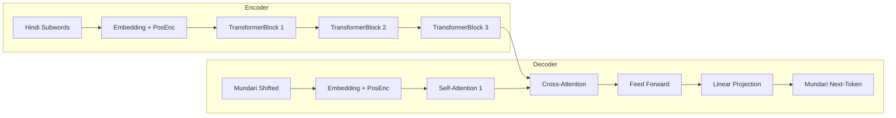
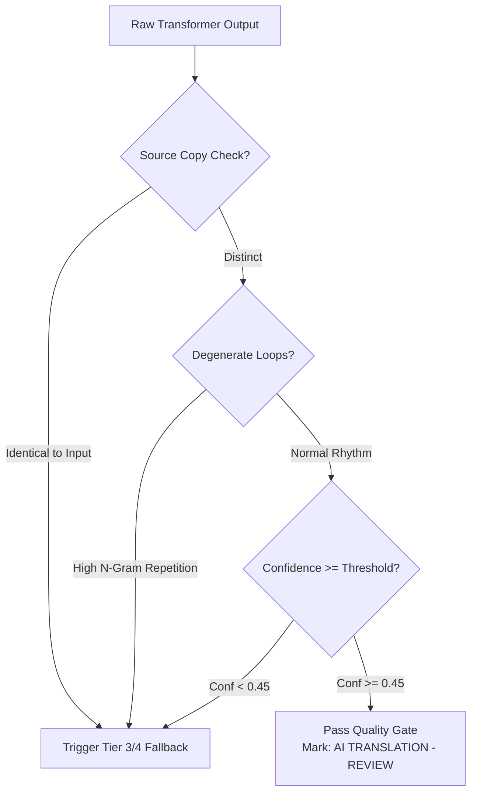

# AI/ML Model Guide: Neural Machine Translation & Edge Speech

This document provides a comprehensive technical guide to the Neural Machine Translation (NMT) and edge speech models deployed in **Bhasha Setu** (`sih`).

---

## 1. Architectural Overview

The AI layer powers mother-tongue primary instruction via two primary subsystems:
1. **Hindi ↔ Mundari Neural Machine Translation**: A specialized, low-resource Seq2Seq Transformer trained on curriculum-aligned parallel text.
2. **Edge Speech Classifier**: Compact acoustic keyword spotting and Voice Activity Detection (VAD) models optimized for mobile/browser execution.

---

## 2. Seq2Seq Transformer Architecture

The production NMT model (`Candidate A`) is an encoder-decoder Transformer engineered specifically for low-resource cross-lingual transfer:



### Hyperparameter Specifications:
| Parameter | Value | Rationale |
|---|---|---|
| **$d_{\text{model}}$** | 256 | Prevents overfitting on 17.8k sentence corpus |
| **Encoder Layers ($N_{\text{enc}}$)** | 3 | Shallow depth balances capacity and latency |
| **Decoder Layers ($N_{\text{dec}}$)** | 3 | Ensures fast autoregressive token generation |
| **Attention Heads ($n_{\text{head}}$)** | 4 | 64 dimensions per head |
| **Feed-Forward Dim ($d_{\text{ff}}$)** | 512 | Compact non-linear expansion |
| **Dropout** | 0.10 | Regularization against token memorization |
| **Positional Encoding** | Sinusoidal | Generalizes across varying sentence lengths |
| **Total Parameters** | **9,725,760** (~9.72M) | Compact footprint for edge / CPU execution |
| **Checkpoint Size** | **110.42 MB** | Managed via Git LFS |

---

## 3. Tokenization Pipeline

The model utilizes subword **Byte-Pair Encoding (BPE)** trained using Hugging Face `tokenizers`:

* **Source (Hindi)**: 6,000 subwords (`models/nmt/tokenizer/hindi_bpe.json`)
* **Target (Mundari)**: 8,000 subwords (`models/nmt/tokenizer/mundari_bpe.json`)
* **Out-of-Vocabulary (OOV) Rate**: **0.0%** on the 902-pair held-out test split.
* **Special Tokens**:
  * `<pad>`: Index 0
  * `<s>`: Index 1 (Beginning of Sequence)
  * `</s>`: Index 2 (End of Sequence)
  * `<unk>`: Index 3 (Unknown Token)

---

## 4. Training Procedure & Optimization

### Dataset Configuration
Trained on the curated **17,863 pair corpus** combining canonical open Mundari text and verified educational vocabulary:
* **Train Split**: 16,059 pairs (90%)
* **Val Split**: 902 pairs (5%)
* **Test Split**: 902 pairs (5%)

### Training Hyperparameters
* **Optimizer**: AdamW ($\text{lr} = 2 \times 10^{-4}$, $\beta_1 = 0.9, \beta_2 = 0.98, \epsilon = 1 \times 10^{-8}$)
* **Weight Decay**: $1 \times 10^{-4}$
* **Learning Rate Schedule**: Cosine Annealing with warmup
* **Loss Function**: Label Smoothing Cross-Entropy ($\alpha = 0.10$)
* **Gradient Clipping**: Max norm = 1.0
* **Batch Size**: 64 pairs
* **Validation Perplexity (Best Epoch)**: **77.53** (Cross-Entropy Loss: 4.35)

---

## 5. Inference & Constrained Beam Search

Inference is implemented in `ai/ml_translation/inference.py`:

```python
from ai.ml_translation.inference import NMTInferenceEngine

engine = NMTInferenceEngine()
result = engine.translate("बच्चे किताब पढ़ रहे हैं")
print(result)
# Output: {'translated_text': '...', 'confidence': 0.82, 'tier': 'NEURAL_TRANSFORMER'}
```

### Decoding Strategies:
* **Beam Search**: Width $K = 3$.
* **Length Normalization**: $\alpha = 0.6$ prevents bias against longer descriptive phrases.
* **Repetition Penalty**: 1.25 prevents degenerative token loops.
* **No-Repeat N-Gram**: Enforces $n = 2$ uniqueness to prevent repetitive subword generation.

---

## 6. Translation Quality Gate

Every neural output passes through `TranslationQualityGate` (`ai/ml_translation/quality_gate.py`) before reaching the teacher UI:



### UI Status Labels:
1. **`VERIFIED EDUCATIONAL`**: Exact match from canonical lexicon (Confidence = 1.0). Ready for unassisted classroom broadcast.
2. **`AI TRANSLATION — REVIEW`**: High-confidence neural or retrieval output. Teacher must review before broadcasting.
3. **`TRANSLATION UNAVAILABLE`**: Graceful refusal on out-of-domain, unverified, or nonsensical input.

---

## 7. Model Exports & Artifact Inventory

All production and candidate artifacts are versioned in `models/`:

| Path | Format | Size | Description |
|---|---|---|---|
| `models/nmt/final/best_transformer.pt` | PyTorch (`.pt`) | 110.42 MB | **Production checkpoint** (Git LFS) |
| `models/nmt/exported/hindi_mundari_nmt.torchscript.pt` | TorchScript JIT | 39.05 MB | Optimized JIT graph for C++ / Android |
| `models/nmt/tokenizer/hindi_bpe.json` | JSON | 540 KB | Source BPE tokenizer vocabulary |
| `models/nmt/tokenizer/mundari_bpe.json` | JSON | 720 KB | Target BPE tokenizer vocabulary |
| `models/edge/speech_vad.tflite` | TFLite | 1.8 MB | Edge Voice Activity Detector |
| `models/edge/speech_classifier.onnx` | ONNX | 4.2 MB | Multilingual acoustic keyword classifier |

---

## 8. How to Re-train or Fine-tune

```bash
# Execute training script with default config
python -m ai.ml_translation.train \
  --data_dir data/processed \
  --output_dir models/nmt/checkpoints_new \
  --epochs 10 \
  --batch_size 64 \
  --lr 2e-4
```
