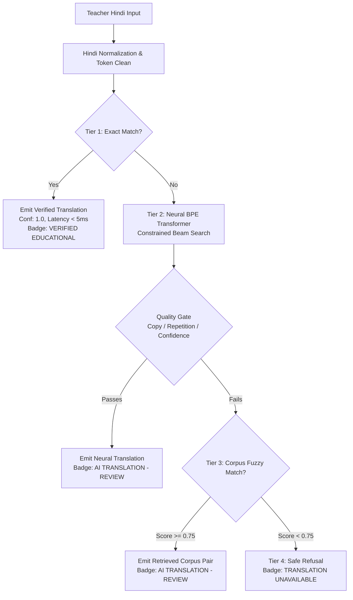
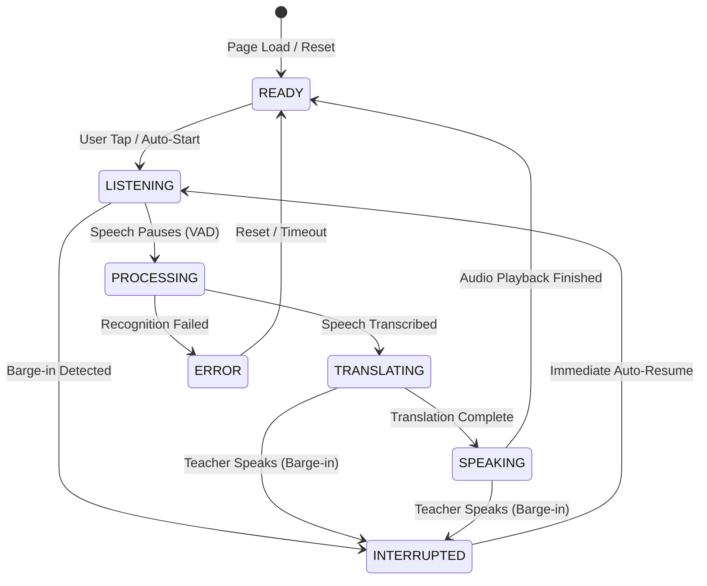

# Bhasha Setu — System Architecture

This document outlines the complete architectural design of **Bhasha Setu** (`sih`), detailing the dual-surface frontend, 4-tier hybrid translation pipeline, continuous voice state machine, offline synchronization protocols, and educational asset management layer.

---

## 1. High-Level System Architecture

```mermaid
graph TD
    subgraph "Frontend Surfaces"
        T[Teacher Workspace<br>Overview, Voice Mode, Modules, Worksheets]
        S[Student Companion<br>Receiver, Audio, Ten-Frames, Practice]
    end

    subgraph "Synchronization Layer"
        BC[HTML5 BroadcastChannel<br>'vfln_classroom_bus' - Zero Latency]
        P2P[Android Wi-Fi Direct / P2P Contract]
    end

    subgraph "Backend API & Local Server (server.py)"
        API[HTTP REST Handler<br>/api/translate, /api/content, /api/health]
        STATIC[Static Asset Server<br>HTML, CSS, JS, Audio, Images]
    end

    subgraph "Educational Layer (ai/educational_content.py)"
        ECM[EducationalContentManager]
        JSONL[data/custom/cleaned_team_pairs.jsonl]
        IMG[data/custom/images/ (130 Assets)]
        REG[content/content_registry.json]
    end

    subgraph "4-Tier Hybrid Translation Engine"
        T1[Tier 1: Canonical Lexicon<br>Numerals, Commands, Verified Vocab<br>< 5ms, 1.0 Conf]
        T2[Tier 2: Neural Seq2Seq Transformer<br>SentencePiece BPE + Beam Search<br>Teacher Review Gate]
        T3[Tier 3: Corpus Retrieval<br>TF-IDF Fuzzy Matching]
        T4[Tier 4: Graceful Refusal<br>Pedagogical Safe Fallback]
    end

    T <--> BC
    S <--> BC
    T --> API
    API --> ECM
    API --> T1
    T1 -- Cache Miss --> T2
    T2 -- Uncertainty --> T3
    T3 -- Low Match --> T4
    ECM --> JSONL
    ECM --> IMG
    ECM --> REG
```

---

## 2. Dual-Surface User Interface

The application separates pedagogical control from student consumption while maintaining real-time synchronization.

### 2.1 Teacher Command Center
* **Overview Page**: High-level teacher command center showing active classroom session status, quick action shortcuts, learning module launch pads, and foundational literacy statistics.
* **Voice & Translate Mode**: Full-screen dark immersive voice interface anchored by the **Continuous Voice Orb**. Provides instantaneous Hindi-to-Mundari translation, speech synthesis playback, and one-click broadcast to student tablets.
* **Curriculum Translation**: Segment-by-segment bilingual lesson preparation with review capabilities.
* **Educational Modules**: 10 FLN vocabulary categories (Animals, Birds, Body Parts, Colors, Family, Flowers, Food, Insects, Vegetables, Vehicles) displaying Mundari terms, Devanagari script, phonetics, and high-resolution visuals.
* **Flashcards Visualizer**: Interactive visual ten-frames for numerals, root etymologies, and audio pronunciation triggers.
* **Printable FLN Worksheets**: 5 exercise generators (`recognition`, `counting`, `matching`, `sequencing`, `missing_numbers`) with responsive A4 print styling.
* **Practice Arena**: Teacher review interface for student performance, accuracy rates, and quiz records.

### 2.2 Student Companion Space
* **Live Classroom Receiver**: Lightweight, distraction-free receiver interface that listens on the local classroom broadcast channel (`MUN-XXXX`).
* **Synchronized Delivery**: Displays the teacher's current phrase in Hindi, verified Mundari translation, phonetic guide, ten-frame representation, and audio trigger.
* **Interactive Reactions**: Quick response buttons (👍 Understood, ✋ Need Help, ❤️ Love this, 💡 Idea) that broadcast student engagement back to the teacher.
* **Self-Paced Practice Quiz**: Child-friendly multiple-choice quiz with immediate auditory and visual reinforcement.
* **Zero Technical Exposure**: Developer metrics, raw model loss values, and internal confidence thresholds are strictly hidden from students and teachers.

---

## 3. 4-Tier Hybrid Translation Pipeline

The translation engine (`ai/translation/translation_engine.py`) employs a multi-tiered architecture that guarantees classroom safety while accommodating open-ended speech:



### Detailed Tier Specifications
1. **Tier 1 — Canonical Lexicon**:
   * Evaluates input against canonical numerals (1–20), 16 core classroom instructions, and human-verified team vocabulary.
   * Execution time is deterministic (< 5 ms). Translations are pre-verified and instantly broadcastable.
2. **Tier 2 — Neural Seq2Seq Transformer**:
   * Encoder-decoder Transformer (9.72M parameters, 3 encoder layers, 3 decoder layers, 4 attention heads, $d_{\text{model}} = 256, d_{\text{ff}} = 512$).
   * Uses SentencePiece Byte-Pair Encoding (6,000 subwords for Hindi, 8,000 for Mundari) with 0% test OOV rate.
   * Employs constrained beam search (beam size = 3, repetition penalty = 1.25, no-repeat 2-grams).
   * Routed through `TranslationQualityGate` to check against source copying, degeneration, or low confidence.
3. **Tier 3 — Corpus TF-IDF Retrieval**:
   * Fallback retrieval engine querying 17,809 attested Mundari-Hindi bilingual pairs.
   * Activated when the neural model fails quality gate criteria.
4. **Tier 4 — Pedagogical Refusal**:
   * Rejects out-of-domain queries or unverified inputs safely with explanatory guidance, preventing classroom misinformation or hallucinations.

---

## 4. Continuous Voice Orb Architecture

The Voice Mode interaction centers on the **Continuous Voice Orb**, an interactive voice control state machine designed for continuous classroom listening with barge-in interruption.

### 4.1 State Machine Diagram



### 4.2 State Contracts
* **`READY`**: "Ready to listen" — Passive state, soft teal glow, awaiting voice activity.
* **`LISTENING`**: "Listening..." — Active recording state, pulsating green glow, streaming mic input.
* **`PROCESSING`**: "Processing..." — Speech pause detected by Voice Activity Detection (VAD), audio packaging.
* **`TRANSLATING`**: "Translating..." — Submitting to `/api/translate`, running through hybrid translation pipeline.
* **`SPEAKING`**: "Speaking Mundari..." — TTS audio playback active, rhythmic expansion animation.
* **`INTERRUPTED`**: "Interrupted — listening again" — Barge-in triggered; speech playback terminates immediately and mic resets to `LISTENING`.
* **`ERROR`**: "Error — tap to retry" — Graceful recovery state with amber alert border.

---

## 5. Offline Multi-Device Synchronization

### 5.1 Local Browser Broadcast (Web Prototype)
* Uses the HTML5 **`BroadcastChannel`** API (`vfln_classroom_bus`).
* Operates completely offline without internet connectivity, third-party brokers, or external servers.
* Messages broadcasted:
  * `TEACHER_BROADCAST`: Contains session ID, phrase, translation, audio URL, ten-frame dot count, and timestamp.
  * `STUDENT_REACTION`: Sends student ID, reaction emoji, and timestamp back to the teacher's active roster.
  * `ROOM_STATE`: Syncs active room codes (`MUN-XXXX`).

### 5.2 Android Native P2P Contract
* Utilizes Android Wi-Fi Direct (`WifiP2pManager`) and local NSD (Network Service Discovery).
* Teachers host a local Hotspot or Wi-Fi Direct group; student tablets connect without internet access.
* Packet payload schema matches the Web `BroadcastChannel` contract byte-for-byte (`android-contract/`).

---

## 6. Educational Content Layer

The educational content subsystem (`ai/educational_content.py`) manages dynamic curriculum assets:

1. **Vocabulary Ingestion**:
   * Reads from `data/custom/cleaned_team_pairs.jsonl` (159 bilingual terms).
   * Validated against `data/custom/SIH_CUSTOM_DATASET_CLEANED_AND_MODEL_READY.xlsx`.
2. **Multimodal Asset Manifest**:
   * Indexed via `data/custom/image_manifest.json`.
   * 130 high-resolution photographic images organized under `data/custom/images/<Category>/`.
   * Dynamic path resolution ensures zero hardcoded system paths.
3. **Curriculum Categories**:
   * 10 core FLN domains: Animals, Birds, Body Parts, Colors, Family, Flowers, Food, Insects, Vegetables, Vehicles.
4. **Provenance & Safety**:
   * Every entry carries explicit status flags (`VALID_READABLE_IMAGE`, `VERIFIED_EDUCATIONAL`, or `UNVERIFIED_HELD_FOR_REVIEW`).
   * Unverified entries are blocked from unassisted classroom broadcast.
