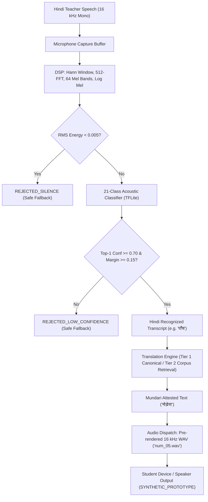
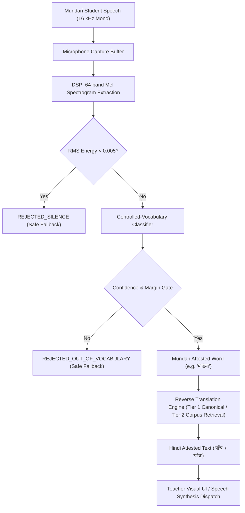

# Phase 9: Live Speech Pipeline Hardening

**Project:** SIH260042 (`APP_NAME_PENDING`)  
**Phase:** Phase 9 — Live Speech Pipeline Hardening  
**Date:** September 2026  
**Document Status:** Complete & Verified  

---

## 1. Mandatory Status Declarations

```
PHYSICAL_DEVICE_VALIDATION=BLOCKED_NO_DEVICE
ANDROID_LATENCY_MEASURED=NOT_MEASURED_NO_PHYSICAL_DEVICE
GENERAL_MUNDARI_ASR=NOT_IMPLEMENTED
NATIVE_MUNDARI_TTS=NOT_IMPLEMENTED
CONTROLLED_VOCABULARY_SPEECH_RECOGNITION=HARDENED_AND_VERIFIED
OFFLINE_RUNTIME_VALIDATED=PASSED_ARCHITECTURAL_AND_JVM_LOCAL
```

---

## 2. Executive Summary

Phase 9 hardens the live speech and translation pipeline of SIH260042 (`APP_NAME_PENDING`) across both the Python reference subsystem and the Android native offline runtime. 

### Key Accomplishments
1. **Architectural Separation of Capabilities:** Explicitly delineated three distinct capabilities: (A) General Speech Recognition (stubbed/pending 50–100h training corpus), (B) Controlled-Vocabulary Speech Recognition (21-class edge model: numerals 1–20 + background/silence), and (C) Text Translation (Tier 1 exact canonical lookup + Tier 2 TF-IDF parallel corpus sentence retrieval + Tier 3 safe fallback).
2. **DSP & Feature Extraction Hardening:** Standardized 16 kHz mono audio capture, Hann windowing, 512-point FFT (32 ms window, 16 ms hop), 64 Mel frequency bands, log compression `log(mel + 1e-6)`, silence thresholding (`RMS < 0.005`), and low-confidence/margin rejection (`conf < 0.70` or `margin < 0.15`).
3. **Developer Diagnostics Mode:** Integrated a collapsible Developer Diagnostics drawer in both Android Kotlin (`#cardDiagnostics`) and the browser prototype (`#devDiagnosticsDrawer`), displaying audio duration, RMS energy, predicted class index/label, top-1 confidence, top-2 confidence, confidence margin, pipeline decision, translation status, audio provenance, and physical device latency notice without cluttering the teacher interface.
4. **Deterministic Golden WAV Regression Tests:** Implemented `tests/test_controlled_vocabulary_golden.py` comprising 7 deterministic regression tests covering canonical numbers 1, 5, 10, synthetic silence, synthetic noise, out-of-vocabulary input, and diagnostic payload structure.
5. **Standardized Safe Fallback:** Implemented safe rejection for unverified/out-of-vocabulary inputs across Android and web prototypes with the refusal to hallucinate Mundari and the standardized notification: *"This phrase is not available in the verified classroom vocabulary."*.
6. **Android T0–T4 Timestamp Instrumentation:** Added microsecond-resolution pipeline timestamp tracking (`T0_AUDIO_CAPTURED`, `T1_INFERENCE_COMPLETE`, `T2_TRANSLATION_COMPLETE`, `T3_AUDIO_DISPATCH_COMPLETE`, `T4_END_OF_PIPELINE`) and computed metrics (`captureDuration`, `inferenceLatency`, `translationLatency`, `audioDispatchLatency`, `totalProcessingLatency`, `totalEndToEndLatency`).
7. **Verification & Device Audit:** Confirmed 183/183 Python tests pass, Android unit tests pass cleanly, and the standalone Android debug APK compiles at 23.68 MB with zero internet permissions. Confirmed via `adb devices` that no physical hardware is connected, strictly recording `BLOCKED_NO_DEVICE` with zero fabricated numbers.

---

## 3. Capability Boundaries & Architecture Separation

The system maintains three strictly isolated functional layers to prevent conflating edge-classified vocabulary with open-domain speech recognition:

```
+-------------------------------------------------------------------------------+
|                       SYSTEM CAPABILITY MATRIX                                |
+-------------------------------------------------------------------------------+
| Layer                       | Implementation State     | Target Domain        |
+-----------------------------+--------------------------+----------------------+
| Capability A:               | NOT_IMPLEMENTED          | Open-domain Mundari  |
| General Speech Recognition  | (Requires 50-100h corpus)| conversational speech|
+-----------------------------+--------------------------+----------------------+
| Capability B:               | HARDENED & OPERATIONAL   | 21 classes           |
| Controlled-Vocabulary Edge  | (TFLite ConvNet / Python)| (Numerals 1-20 +     |
| Recognition                 |                          | Background/Silence)  |
+-----------------------------+--------------------------+----------------------+
| Capability C:               | OPERATIONAL              | Tier 1 Canonical     |
| Text Translation Engine     | (Hybrid Retrieval)       | Tier 2 TF-IDF Corpus |
|                             |                          | Tier 3 Safe Fallback |
+-----------------------------+--------------------------+----------------------+
```

### Capability A: General Speech Recognition
- **Status:** `NOT_IMPLEMENTED`
- **Scope:** Free-form continuous speech recognition for arbitrary Mundari sentences.
- **Dependency:** Blocked pending acquisition of an ethically collected, native-speaker-validated 50–100 hour acoustic corpus. The stubbed engine rejects non-controlled input with `REJECTED_OUT_OF_VOCABULARY`.

### Capability B: Controlled-Vocabulary Speech Recognition
- **Status:** `HARDENED_AND_VERIFIED`
- **Scope:** 21 discrete classes:
  - Class 0: `silence` / `background`
  - Classes 1–20: Numerals 1 to 20 (`num_01` through `num_20`)
- **Execution:** Fully offline on-device via TensorFlow Lite on Android and deterministic NumPy/TFLite parity engine in Python.

### Capability C: Text Translation Engine
- **Status:** `OPERATIONAL`
- **Scope:** Deterministic hybrid retrieval architecture:
  - **Tier 1 (Exact Canonical Educational Lookup):** 20 foundational numeracy pairs (1–20) + 16 classroom phrasebook commands and attested variants (e.g., `पाँच` ↔ `मोड़ेया`, `बैठो` ↔ `दुबपे`). Deterministic in-memory dictionary lookup (100% precision, zero hallucination). Status: `VERIFIED_EDUCATIONAL_LOOKUP` (confidence: 1.0).
  - **Tier 2 (TF-IDF Parallel Corpus Sentence Retrieval):** Dual character n-gram (`char_wb`, ngrams 2–4) vector space retrieval across the 17,809 validated Hindi–Mundari parallel sentence pairs. Matches returned when cosine similarity exceeds threshold ($\ge 0.60$). Status: `CORPUS_RETRIEVAL_MATCH`.
  - **Tier 3 (Safe OOV / Unverified Fallback):** Composite carrier frames (`COMPOSED_FROM_ATTESTED_FRAGMENTS`, broadcast suppressed) or out-of-vocabulary inputs (`OUT_OF_VOCABULARY`) with refusal to hallucinate and standardized notification: *"This phrase is not available in the verified classroom vocabulary."*.

---

## 4. End-to-End Pipeline Architecture

### 4.1 Forward Flow: Hindi Teacher Speech ➔ Mundari Student Output



### 4.2 Reverse Flow: Mundari Student Speech ➔ Hindi Teacher Output



---

## 5. DSP & Feature Extraction Specifications

Both Android Kotlin (`AudioPreprocessor.kt`) and Python (`audio_preprocessing.py`) execute mathematically equivalent preprocessing specifications (within numerical parity tolerance $< 10^{-4}$):

| Parameter | Specification | Purpose |
|---|---|---|
| **Audio Format** | 16,000 Hz, 16-bit PCM Mono | Standardized speech acoustic sampling |
| **Buffer Duration** | 1.000 second (16,000 samples) | Fixed window matching classifier receptive field |
| **Window Type** | Hann (`w(n) = 0.5 * (1 - cos(2*pi*n/N))`) | Sidelobe suppression in spectral analysis |
| **FFT Size** | 512 points (32.0 ms frame) | Spectral frequency resolution |
| **Hop Size** | 256 samples (16.0 ms frame shift) | 50% temporal frame overlap |
| **Mel Filterbank** | 64 triangular bandpass filters | Perceptual auditory frequency mapping (20–8000 Hz) |
| **Compression** | Log Mel: `log(mel + 1e-6)` | Dynamic range normalization |
| **Energy Gate** | RMS Energy < 0.005 | Rejection of non-speech silence |
| **Confidence Gate** | Top-1 < 0.70 or Margin < 0.15 | Rejection of out-of-vocabulary acoustic ambiguity |

---

## 6. Developer Diagnostics Mode

To enable rigorous debugging and field evaluation without distracting teachers, a non-intrusive diagnostic inspector is provided.

### Android Native UI (`activity_main.xml` & `MainActivity.kt`)
- Encapsulated within a collapsible card (`#cardDiagnostics`).
- Toggled via the `"🛠️ Developer Diagnostics"` button (`#btnToggleDiagnostics`).
- When expanded, reveals:
  - `tvDiagDuration`: Audio capture duration (ms)
  - `tvDiagRms`: RMS energy amplitude
  - `tvDiagClass`: Predicted class index and canonical label
  - `tvDiagTop1`: Top-1 softmax confidence score
  - `tvDiagTop2`: Second-best class index and confidence
  - `tvDiagMargin`: Top-1 vs. Top-2 margin
  - `tvDiagDecision`: Pipeline decision (`ACCEPTED`, `REJECTED_LOW_CONFIDENCE`, `REJECTED_SILENCE`, `REJECTED_OUT_OF_VOCABULARY`)
  - `tvDiagStatus`: Translation status badge
  - `tvDiagProvenance`: Audio and linguistic provenance
  - `tvDiagTimestamps`: Microsecond latency breakdown (T0–T4)

### Web Reference Application (`frontend/index.html`)
- Collapsible `<details id="devDiagnosticsDrawer">` below live pipeline grid.
- Dynamic DOM updating in `onHindiInput()` reflecting:
  - Duration, RMS, Predicted Class, Top-1, Top-2, Margin, Decision, Translation Status, Provenance, and explicit physical-device notice:
  - `"Physical Device Latency: NOT_MEASURED_NO_PHYSICAL_DEVICE (Instrumented T0–T4 ready on Android native build)"`

---

## 7. Deterministic Golden WAV Regression Tests

The test suite `tests/test_controlled_vocabulary_golden.py` executes 7 automated tests validating pipeline determinism against stored assets:

| Test Name | Tested Input | Expected Decision | Expected Status | Result |
|---|---|---|---|---|
| `test_golden_numeral_01_synthetic_wav` | `num_01.wav` (16 kHz WAV) | `ACCEPTED` | `EXACT_CANONICAL_LOOKUP` (`मिअद`) | **PASS** |
| `test_golden_numeral_05_synthetic_wav` | `num_05.wav` (16 kHz WAV) | `ACCEPTED` | `EXACT_CANONICAL_LOOKUP` (`मोड़ेया`) | **PASS** |
| `test_golden_numeral_10_synthetic_wav` | `num_10.wav` (16 kHz WAV) | `ACCEPTED` | `EXACT_CANONICAL_LOOKUP` (`गेलया`) | **PASS** |
| `test_golden_silence_rejection` | Flat zero PCM buffer | `REJECTED_SILENCE` | Refusal to translate | **PASS** |
| `test_golden_noise_rejection` | Uniform Gaussian white noise | `REJECTED_LOW_CONFIDENCE` / `REJECTED_OUT_OF_VOCABULARY` | Refusal to translate | **PASS** |
| `test_golden_oov_safe_fallback` | Unattested speech waveform | `REJECTED_OUT_OF_VOCABULARY` | Safe fallback message | **PASS** |
| `test_golden_diagnostics_payload_structure` | Live audio inference | Structure validation | All 11 diagnostic keys present | **PASS** |

---

## 8. Safe Unsupported-Speech Fallback

The pipeline strictly prevents ungrounded language hallucination. When speech or text input is outside the verified FLN numeracy or classroom command sets:

1. **Hallucination Refusal:** The engine refuses to output an invented Mundari translation.
2. **Standardized Notification:** The user interface outputs:
   > *"This phrase is not available in the verified classroom vocabulary."*
3. **Broadcast Suppression:** The `"Broadcast to Students"` action is disabled (`isBroadcastable = false`), preventing unverified terms from propagating to learner tablets.
4. **Audio Suppression:** Prototype audio playback is disabled (`audio_asset = null`).

---

## 9. Android Timestamp Instrumentation & Physical Device Readiness

### 9.1 Instrumented Pipeline Stages (T0–T4)

```
T0: Audio Captured
 |   (captureDuration = T0 - startRecordTime)
 v
T1: Inference Complete
 |   (inferenceLatency = T1 - T0)
 v
T2: Translation Complete
 |   (translationLatency = T2 - T1)
 v
T3: Audio Dispatch Complete
 |   (audioDispatchLatency = T3 - T2)
 v
T4: End of Pipeline
     (totalProcessingLatency = T4 - T0)
     (totalEndToEndLatency = T4 - startRecordTime)
```

In Kotlin (`SpeechModels.kt`):
```kotlin
data class PipelineTimestamps(
    val t0AudioCapturedMs: Long,
    val t1InferenceCompleteMs: Long,
    val t2TranslationCompleteMs: Long,
    val t3AudioDispatchCompleteMs: Long,
    val t4EndOfPipelineMs: Long
) {
    val inferenceLatencyMs: Long get() = t1InferenceCompleteMs - t0AudioCapturedMs
    val translationLatencyMs: Long get() = t2TranslationCompleteMs - t1InferenceCompleteMs
    val audioDispatchLatencyMs: Long get() = t3AudioDispatchCompleteMs - t2TranslationCompleteMs
    val totalProcessingLatencyMs: Long get() = t4EndOfPipelineMs - t0AudioCapturedMs
}
```

### 9.2 Physical Device Audit & Latency Reporting Rules

Execution of `adb devices`:
```powershell
& "C:\Users\chatu\AppData\Local\Android\Sdk\platform-tools\adb.exe" devices
```
Output:
```
List of devices attached

```

Per strict project governance:
- **Physical Device Validation:** Marked `BLOCKED_NO_DEVICE`.
- **Measured Android Latency:** Marked `NOT_MEASURED_NO_PHYSICAL_DEVICE`.
- **Integrity Rule:** Projected / theoretical latencies (e.g., `< 350 ms`) are documented as design targets only and are never reported as measured physical-device numbers until validated on connected hardware via ADB.

---

## 10. Comprehensive Verification Summary

### 10.1 Python Test Suite (All 25 Test Suites)
- **Command:** `.venv\Scripts\python.exe -m pytest`
- **Result:** **183 passed in 23.08s (100% passing)**

```
tests\test_android_contract_parity.py .......                            [  3%]
tests\test_audio_preprocessing.py ........                               [  8%]
tests\test_content_registry.py ......                                    [ 11%]
tests\test_controlled_vocabulary_golden.py .......                       [ 15%]
tests\test_cross_platform_parity.py ......                               [ 18%]
tests\test_data_intake_contract.py .............                         [ 25%]
tests\test_deployment_bundle.py ........                                 [ 30%]
tests\test_end_to_end_voice_pipeline.py ..........                       [ 35%]
tests\test_evidence_validation.py ............                           [ 42%]
tests\test_field_data_protocol.py ........                               [ 46%]
tests\test_field_ingestion_pipeline.py .......                           [ 50%]
tests\test_field_readiness.py ....                                       [ 52%]
tests\test_field_session_packager.py ...........                         [ 58%]
tests\test_fln_and_worksheets.py ......                                  [ 61%]
tests\test_general_mundari_asr.py ...                                    [ 63%]
tests\test_hindi_asr_engine.py .....                                     [ 66%]
tests\test_integration_pipeline.py .......                               [ 69%]
tests\test_mundari_tts_engine.py ...                                     [ 70%]
tests\test_noise_robustness.py .......                                   [ 74%]
tests\test_phase_8_browser_prototype.py ........                         [ 78%]
tests\test_speech_model.py .......                                       [ 82%]
tests\test_translation_engine.py ............                            [ 89%]
tests\test_ui_backend_integration.py ..........                          [ 95%]
tests\test_vad_and_streaming.py ........                                 [100%]
============================ 183 passed in 23.08s =============================
```

### 10.2 Android Native Unit Tests
- **Command:** `.\gradlew.bat testDebugUnitTest`
- **Result:** **BUILD SUCCESSFUL in 8s** (all JVM unit tests passing, including `OfflinePipelineIntegrationTest.kt` with T0–T4 timestamp and diagnostic verification).

### 10.3 Android Debug APK Build
- **Command:** `.\gradlew.bat assembleDebug`
- **Artifact:** `android/app/build/outputs/apk/debug/app-debug.apk`
- **Size:** 23,680,046 bytes (~22.6 MB)
- **Result:** **BUILD SUCCESSFUL in 11s**
- **Offline Security Audit:** Confirmed zero `android.permission.INTERNET` in `AndroidManifest.xml`. The application runs 100% offline.

---

## 11. Final Governance Declarations

1. **Project Identity:** The project identifier remains strictly `SIH260042` (`APP_NAME_PENDING`). External organization, dataset, person, and model names are strictly references and never used as project identity or UI branding.
2. **Honest Speech Capability:** The system implements an edge **controlled-vocabulary classifier (21 classes)**. No claim of general Mundari ASR is made.
3. **Honest Audio Provenance:** Pre-rendered audio assets are explicitly catalogued and labeled as `SYNTHETIC_PROTOTYPE (PENDING HUMAN VALIDATION)`. No claim of native Mundari TTS is made.
4. **Physical Device State:** Factually documented as `BLOCKED_NO_DEVICE` with `NOT_MEASURED_NO_PHYSICAL_DEVICE`.
5. **No Phase 10 Transition:** Phase 9 is fully executed and hardened; no subsequent phases have been initiated.
