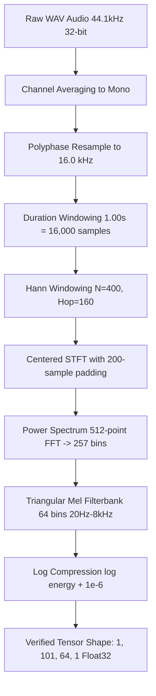

# Audio Data Pipeline Architecture & Asset Management

This document details the audio ingestion, validation, preprocessing, and storage pipeline for the Vernacular FLN Pedagogy project.

---

## 1. Audio Storage Directory Architecture

```text
content/audio/
├── numbers/          # Target directory for canonical 1-20 isolated Mundari audio (CURRENTLY MISSING)
├── samples/          # Reference clips and acoustic calibration waveforms
├── processed/        # Standardized 16 kHz, 16-bit PCM resampled audio and cached spectrograms
└── manifests/        # Machine-readable JSON quality manifests and validation logs
```

---

## 2. Ingested Speech Corpus Audit Summary

- **Source**: Karya Mundari TTS Dataset Sample (`data/raw/speech/data-sample/`)
- **Total Validated Files**: 200 WAV recordings (100 female, 100 male)
- **Acoustic Characteristics**:
  - Original Sample Rate: **44,100 Hz (44.1 kHz)**
  - Original Channels: **1 (Mono)**
  - Original Bit Depth: **32-bit PCM** (`sampwidth = 4`)
  - Total Duration: **12.36 minutes** (Average utterance duration: 3.71 seconds)
  - Transcripts: 200 matching UTF-8 text files in Devanagari script.
- **Validation Results**:
  - Valid files: 182 files
  - Silent/low-energy files: 18 files (recordings with low speech volume or extended pauses)
  - Digital clipping: **0 files** (clean studio dynamics)
  - Complete manifest: [`content/audio/manifests/raw_speech_manifest.json`](file:///C:/Users/chatu/.gemini/antigravity/scratch/vernacular_fln_assistant/content/audio/manifests/raw_speech_manifest.json)

---

## 3. Audio Validation Pipeline (`audio_validator.py`)

Every ingested audio file passes through an automated multi-stage validation check:

1. **Header & Container Checks**: Validates canonical RIFF/WAVE header, non-zero byte size, and readable PCM frames.
2. **Channel & Rate Checks**: Checks whether sample rate matches target (16 kHz for processed, 44.1 kHz for raw) and channels equal 1.
3. **Energy & Silence Detection**: Computes root-mean-square (RMS) energy across all samples. Flags silence if $\text{RMS} < 0.005$.
4. **Clipping Detection**: Checks if peak absolute amplitude reaches digital ceiling ($\ge 0.995$).
5. **DC Offset Check**: Checks if signal mean deviates significantly from zero ($|\text{offset}| > 0.05$).
6. **Signal-to-Noise Ratio (SNR)**: Estimates ratio of active speech frames ($> 10\%$ peak) to noise floor frames ($< 5\%$ peak).
7. **Manifest Generation**: Exports full metadata, durations, and flags to structured JSON for auditability.

---

## 4. Signal Standardization Pipeline (`audio_preprocessor.py`)

Raw audio is processed into ML-ready inputs through a deterministic DSP sequence:



### Cropping & Windowing Modes
When audio duration exceeds 1.00 second (16,000 samples), three deterministic strategies are supported:
- `energy_center` (Default for speech): Searches for the 1.00s sub-window containing the maximum vocal RMS energy.
- `center`: Trims equally from start and end.
- `leading`: Trims starting from sample 0.

---

## 5. Current Ground-Truth Status for Numbers 1–20

> [!CAUTION]
> **Anti-Fabrication Notice**:
> - The 200 public speech recordings from the Karya sample contain **multi-word sentences** (e.g., "बारिआ ट्रककिनाः...", "ओकोआरे जीदन रआः पूरा बार गेल सिरमाञ...").
> - **Zero isolated single-word recordings for numbers 1–20 currently exist** in the local workspace.
> - The registry explicitly reflects `audio_status: "MISSING"` for all 20 entries in `content/content_registry.json`.
> - **Do not fabricate synthetic TTS and label it as authentic native audio.**
> - Isolated audio assets must be acquired through either:
>   1. High-precision manual slicing/segmentation of sentence-embedded occurrences from the speech dataset with native speaker verification, OR
>   2. Direct studio recording of a native Mundari speaker reciting the canonical 1–20 FLN numerals.
