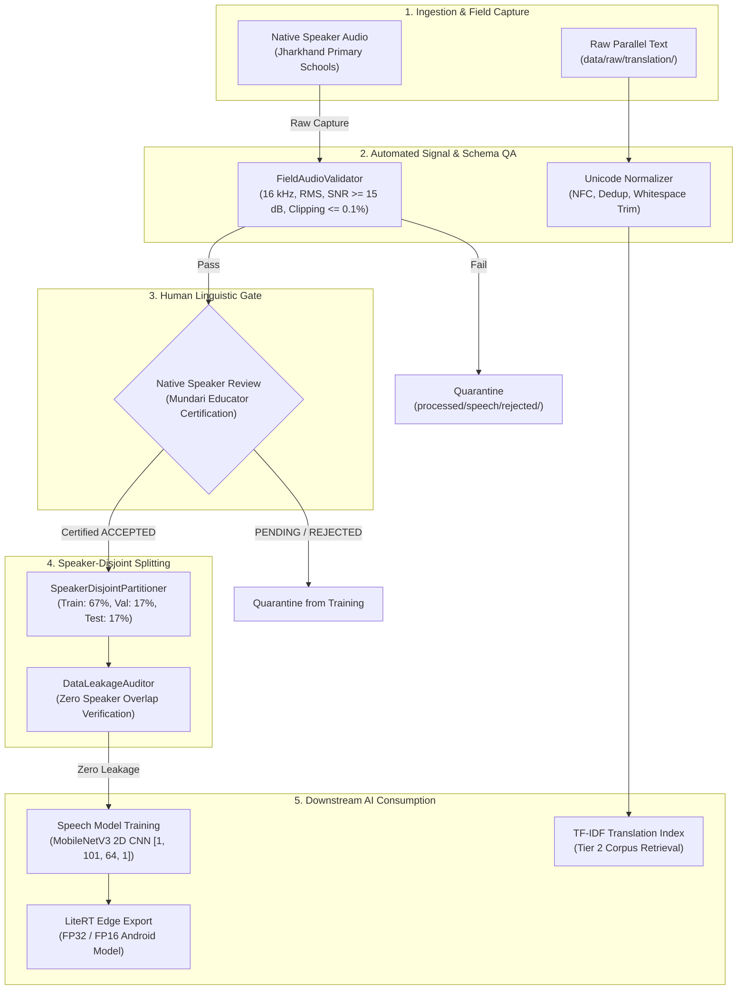

# Data Architecture & Multi-Stage Lifecycle Specification

**Project**: AI-Powered Vernacular Pedagogy & Real-Time Translation Tool for Primary Education  
**Document ID**: `docs/data-architecture.md`  
**Architecture Version**: `1.0.0`  
**Date**: `2026-09-04`  

---

## 1. Directory Structure & Immutable Separation

In accordance with strict data integrity and governance rules, data is strictly organized into four segregated tiers. Raw original data is immutable and never overwritten.

```text
data/
├── raw/                               # Immutable raw external & field recordings
│   ├── speech/                        # External speech sample & checksums
│   │   ├── data-sample/               # 200 audited studio takes
│   │   └── dataset-mundari-tts-full.sha1
│   ├── translation/                   # Raw parallel corpus
│   │   ├── translation-hi-unr.tsv     # Untouched 17,826-line TSV
│   │   ├── COPYRIGHT_translation.txt
│   │   └── LICENSE_translation.txt
│   └── reference/                     # Lexicographic & grammatical source texts
│
├── processed/                         # Validated, normalized, cleaned datasets
│   ├── translation/                   # Deduplicated, NFC-normalized corpus
│   │   └── clean_bilingual_corpus.tsv # 17,804 clean pairs for Tier 2 retrieval
│   ├── speech/                        # Standardized 16 kHz 16-bit mono field audio
│   │   ├── accepted/                  # Takes passing automated QA and native review
│   │   └── rejected/                  # Technical QA defects (quarantined)
│   └── fln/                           # Pre-rendered educational flashcards & assets
│
├── metadata/                          # Provenance catalogs, inventories & schemas
│   ├── source_manifest.json           # Master legal provenance & licensing ledger
│   ├── speech_dataset_inventory.json  # Comprehensive speech corpus metrics
│   ├── translation_dataset_inventory.json # Translation corpus token & vocabulary stats
│   ├── mundari_number_coverage.json   # Deep 1-20 numeral audit across all corpora
│   ├── recording_manifest.schema.json # JSON Schema Draft 2020-12
│   └── mock_field_recording_manifest.json
│
└── splits/                            # Strictly partitioned, leakage-audited splits
    ├── train.txt                      # Training set recording IDs
    ├── val.txt                        # Validation set recording IDs
    ├── test.txt                       # Held-out evaluation set recording IDs
    └── session_splits.json            # Speaker allocation & audit receipt
```

---

## 2. End-to-End Data Lifecycle



---

## 3. Data Ingestion & Quality Gates

### Gate 1: Audio Signal QA (`FieldAudioValidator`)
All incoming audio must strictly comply with physical acoustic standards:
- **Format**: 16,000 Hz sample rate, single channel mono, 16-bit PCM WAV.
- **Energy**: Speech RMS between $-30.0	ext{ dBFS}$ and $-12.0	ext{ dBFS}$.
- **Signal-to-Noise Ratio**: SNR $\ge 15.0	ext{ dB}$.
- **Clipping**: $\le 0.1\%$ samples reaching $\pm 32,000$.
- **Utterance Duration**: $0.35	ext{ s}$ to $2.00	ext{ s}$ ($5,600$ to $32,000$ samples).
- **Silence Margins**: $\ge 50	ext{ ms}$ lead-in and trailing silence to ensure unclipped word onsets and offsets.
- **Background Noise Takes (Class 0)**: Non-speech ambient audio evaluated at $-55.0	ext{ dBFS}$ to $-20.0	ext{ dBFS}$.

### Gate 2: Human Linguistic Review
- Every recording is manifested with `review.status = "UNREVIEWED"` upon intake.
- Native Mundari educators review pronunciation and dialect authenticity.
- Only recordings transitioning to `"ACCEPTED"` enter the training set.
- Training loaders strictly filter on `review_status == "ACCEPTED"`.

### Gate 3: Speaker-Disjoint Partitioning & Anti-Leakage
- Speakers are assigned exclusively to either **Train**, **Validation**, or **Test** partitions.
- No speaker's voice ever crosses partition boundaries.
- Multi-tier leakage detection checks:
  1. Speaker ID disjointness ($S_{train} \cap S_{val} = \emptyset$, $S_{train} \cap S_{test} = \emptyset$, $S_{val} \cap S_{test} = \emptyset$).
  2. Recording ID uniqueness.
  3. Audio file SHA-256 hash collision checks.

---

## 4. Extensibility Beyond Numbers 1–20

While Numbers 1–20 constitute the guaranteed FLN numeracy MVP, the data architecture is explicitly designed for seamless expansion:

```text
Target Catalog
├── Class 0: Silence & Classroom Background Noise
├── Classes 1–20: FLN Grade 1 Numerals (मिअद .. बार हिसि)
├── Category: Classroom Commands
│   ├── cmd_listen ("आयुमेपे" / सुनो)
│   ├── cmd_repeat ("दोहरावपे" / दोहराओ)
│   ├── cmd_sit ("दुबपे" / बैठो)
│   ├── cmd_stand ("तिंगुपे" / खड़े हो जाओ)
│   ├── cmd_open_book ("किताब ओलोपे" / किताब खोलो)
│   └── cmd_good_work ("बेस कामी" / शाबाश)
└── Category: Foundational FLN Vocabulary
    ├── fln_count ("लेखा" / गिनना)
    ├── fln_add ("जोड़ाव" / जोड़ना)
    ├── fln_sub ("घटाव" / घटाना)
    └── fln_shapes ("रुप / आकार" / आकार)
```

The modular `VocabularySpeechRecognizer` and `SpeechRecognitionManager` interfaces ingest target IDs dynamically from `content/content_registry.json` without requiring core pipeline rewrites.
