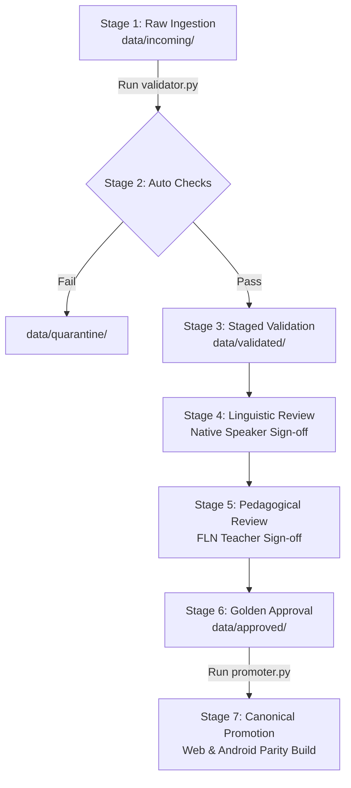

# Data Intake Contract & Specification

**Project ID**: SIH260042  
**Application**: APP_NAME_PENDING (Vernacular FLN Assistant — Hindi ↔ Mundari)  
**Document Version**: 1.0.0 (Production Intake Baseline)  
**Status**: ACTIVE & BINDING  

---

## 1. Executive Summary & Purpose

This document establishes the binding **Data Intake Contract** for the SIH260042 Vernacular Foundational Literacy and Numeracy (FLN) Assistant. 

Prior to this contract, early prototypes operated under strict functional locks to prevent hallucination, unverified translations, or corrupted phonetic mappings from reaching tribal classrooms in Jharkhand. As the project expands its bilingual coverage (Hindi ↔ Mundari), all newly acquired or submitted linguistic, acoustic, and curriculum data must strictly comply with this automated, verifiable, and multi-stage intake pipeline.

**Core Mandate**:
> **No external dataset, translation pair, audio recording, or curriculum entry may enter the production application, mobile APK assets, or canonical content registries without passing all 7 formal promotion stages.**

---

## 2. Directory Hierarchy & Four-Tier Quarantine Model

The data directory structure enforces strict isolation between untrusted incoming resources and production-approved canonical datasets:

```
data/
├── incoming/             # Tier 1: Untrusted Staging (Read/Write for submitters)
├── quarantine/           # Tier 2: Isolated Rejections (Automated quarantine)
├── validated/            # Tier 3: Technically Verified (Passes schemas, waiting for humans)
├── approved/             # Tier 4: Gold Standard (Human signed-off, ready for promotion)
├── schemas/              # Machine-readable JSON Schemas & Enums
│   ├── status_enums.json
│   ├── parallel_translation.schema.json
│   ├── classroom_phrase.schema.json
│   ├── native_audio.schema.json
│   ├── speech_recognition.schema.json
│   ├── curriculum_data.schema.json
│   └── license_manifest.schema.json
└── templates/            # Human review forms & submission templates
    ├── human_validation_form.md
    └── candidate_*_template.json
```

### Quarantine Staging Workflow
1. **`data/incoming/`**: All raw submissions land here. Files are treated as untrusted bytecode. Automated CI/CD scanners and intake scripts analyze candidate files without touching production runtime code.
2. **`data/quarantine/`**: Any file failing automated validation (schema invalid, missing license, duplicate text, identical Hindi-Mundari string, corrupted audio headers, speaker leakage) is immediately moved here along with an automated failure manifest. No human reviewer wastes time on quarantined assets until issues are remediated.
3. **`data/validated/`**: Files that pass 100% of automated syntax, schema, acoustic, and duplicate checks are staged here. They are structurally perfect but lack human linguistic/pedagogical sign-off.
4. **`data/approved/`**: Contains only datasets that have passed automated validation AND received cryptographic/formal human validation from native Mundari linguists and certified FLN educators.

---

## 3. Data Intake Schemas & Required Fields

All candidate submissions must be formatted as JSON arrays conforming to the authoritative JSON Schemas located in `data/schemas/`.

### 3.1 Hindi ↔ Mundari Parallel Translation (`parallel_translation.schema.json`)
Every record must provide complete provenance and linguistic metadata:
- `record_id`: Unique identifier formatted as `TRANS-[A-Z0-9_-]{3,32}`.
- `hindi_text`: Normalized Devanagari Hindi text.
- `mundari_text`: Mundari text in verified Devanagari script.
- `mundari_script`: Script identifier (`"Devanagari"` or `"Mundari Bani"`).
- `ipa`: International Phonetic Alphabet representation of the Mundari pronunciation.
- `domain`: Domain tag (`"Foundational Numeracy"`, `"Foundational Literacy"`, `"Classroom Instruction"`, etc.).
- `grade`: Target educational grade (`"Balvatika"`, `"Grade 1"`, `"Grade 2"`, `"Grade 3"`).
- `lesson`: Specific lesson or thematic unit.
- `source`: Attested provenance (`"NCERT Jaipal Singh FLN Module"`, `"Central Institute of Indian Languages"`, etc.).
- `source_reference`: Specific citation, chapter, page, or corpus entry identifier.
- `license`: Open-source license or government institutional permission identifier.
- `provenance_status`: Intake provenance level (`"FIELD_COLLECTED"`, `"INSTITUTIONAL_APPROVED"`, etc.).
- `linguistic_validation_status`: Linguistic verification state.
- `educational_validation_status`: Pedagogical verification state.
- `notes`: Specific context, dialectal variation, or usage notes.

### 3.2 Classroom Phrasebook (`classroom_phrase.schema.json`)
Covers teacher-student classroom spoken interaction:
- `phrase_id`: Formatted as `PHR-[A-Z0-9_-]{3,32}`.
- `hindi_text`, `mundari_text`, `category`, `classroom_use`, `grade`, `ipa`, `source`, `provenance_status`, `linguistic_validation_status`, `educational_validation_status`, `plural_imperative_handled`.

### 3.3 Native Audio (`native_audio.schema.json`)
Covers human reference speech recordings:
- `audio_id`: Formatted as `AUD-[A-Z0-9_-]{3,32}`.
- `file_path`: Relative path to WAV file. Must exist and be a valid WAV file.
- `text_reference`: Exact transcription of spoken content.
- `speaker_id`: Anonymized speaker identifier (e.g., `SPK-MUN-042`).
- `speaker_demographics`: Age group, gender, dialect region (e.g., `"Hasada"`, `"Naguri"`), native fluency (`"NATIVE_FIRST_LANGUAGE"`).
- `acoustic_format`: Strict format enforcement:
  - `sample_rate_hz`: `16000` (strictly 16 kHz)
  - `bit_depth`: `16` (strictly 16-bit PCM)
  - `channels`: `1` (strictly mono)
  - `snr_db`: Measured Signal-to-Noise Ratio (minimum $\ge 15.0$ dB).
- `duration_ms`: Duration in milliseconds (between 200 ms and 15,000 ms).
- `recording_environment`: Ambient noise characterization (`"QUIET_INDOOR"`, `"RURAL_CLASSROOM"`, etc.).
- `license`: Permitted audio distribution license.
- `consent_record`: Written consent tracking ID (strictly required).
- `provenance_status`, `linguistic_validation_status`.

### 3.4 Speech Recognition Corpus (`speech_recognition.schema.json`)
Covers ASR training, validation, and benchmark test sets:
- `utterance_id`: Formatted as `ASR-[A-Z0-9_-]{3,32}`.
- `audio_id`: Linked native audio record ID.
- `transcription`: Exact orthographic transcript.
- `split`: Partition assignment (`"TRAIN"`, `"VAL"`, `"TEST"`).
- **Leakage Prevention Rule**: All utterances from any individual `speaker_id` must be strictly confined to exactly one split. Cross-split speaker leakage causes instant validation failure.

### 3.5 Curriculum & FLN Data (`curriculum_data.schema.json`)
Covers educational scaffolding aligned with NIPUN Bharat guidelines:
- `item_id`: Formatted as `CURR-[A-Z0-9_-]{3,32}`.
- `concept_code`: NIPUN Bharat learning outcome code (e.g., `M-G1-01`).
- `subject`: `"NUMERACY"` or `"LITERACY"`.
- `grade`: `"Balvatika"`, `"Grade 1"`, `"Grade 2"`, or `"Grade 3"`.
- `bilingual_pairs`: Array of translated vocabulary and prompt records.

### 3.6 License Manifest (`license_manifest.schema.json`)
Enforces legal attribution and gatekeeper checks for every submitted resource package:
- `manifest_id`: Unique manifest tracking ID.
- `resource_name`: Title of resource.
- `license_type`: Approved license identifier (`"CC-BY-4.0"`, `"CC0-1.0"`, `"Apache-2.0"`, `"MIT"`, `"Government Open Data"`, `"Institutional Research Permission"`).
- `author_or_institution`: Primary copyright holder or recording institution.
- `documentation_url`: URL or local archive path to deed or legal grant.
- `commercial_use_allowed`: Boolean.
- `redistribution_allowed`: Boolean.
- `attribution_required`: Boolean.

---

## 4. Controlled Status State Machines & Transition Rules

To prevent ambiguous statuses like "in progress" or "draft", all components must adhere to controlled enumeration statuses defined in `data/schemas/status_enums.json`.

### 4.1 Translation Status Transitions
```
UNVERIFIED
    ↓ (passes automated validator)
AUTOMATED_VALIDATED
    ↓ (native speaker verifies dialect & semantics)
NATIVE_VERIFIED
    ↓ (elementary teacher validates grade appropriateness)
PEDAGOGICALLY_APPROVED
    ↓ (cross-platform build parity verified)
CANONICAL_LOCKED
```
*Failure states*: `QUARANTINED`, `REJECTED`, `LICENSE_REVIEW_REQUIRED`.

### 4.2 Audio Status Transitions
```
RAW_RECORDING
    ↓ (passes 16kHz mono 16-bit acoustic checks + SNR >= 15dB)
ACOUSTICALLY_VERIFIED
    ↓ (native speaker confirms natural cadence & accent)
HUMAN_AUDITED
    ↓ (curriculum committee accepts into lesson plan)
CANONICAL_REFERENCE
```
*Failure states*: `ACOUSTIC_REJECTED`, `METADATA_INCOMPLETE`, `UNCONSENTED`.

---

## 5. Licensing Gatekeeper Matrix

| License Type | Ingestion Allowed? | Staging Status | Action Required |
| :--- | :---: | :---: | :--- |
| **CC0-1.0 / Public Domain** | YES | Direct Validation | Standard automated check |
| **CC-BY-4.0** | YES | Direct Validation | Ensure attribution is recorded |
| **Apache-2.0 / MIT** | YES | Direct Validation | Include full license text in manifest |
| **Institutional / Field MoA** | YES | Manual Review | Verify signed institutional agreement |
| **CC-BY-NC / CC-BY-ND** | CONDITIONAL | `LICENSE_REVIEW_REQUIRED` | Legal review for deployment bounds |
| **Scraped / Copyrighted** | **STRICT NO** | **QUARANTINED** | Instant deletion / rejection |
| **Unknown / Unspecified** | **STRICT NO** | **QUARANTINED** | Flagged as `LICENSE_REVIEW_REQUIRED` |

---

## 6. Automated Validation Checks Reference Table

The automated intake validator (`tools/data_intake/validator.py`) runs 9 deterministic verification passes:

| # | Check Name | Failure Condition | Target Severity |
| :-: | :--- | :--- | :--- |
| 1 | **Schema Conformance** | JSON structure deviates from authoritative JSON schema | BLOCKING (Quarantine) |
| 2 | **Missing Required Fields** | Any required metadata key is null or absent | BLOCKING (Quarantine) |
| 3 | **Duplicate Records** | Duplicate `record_id` or identical source-target text pairs | BLOCKING (Quarantine) |
| 4 | **Empty Translation** | Translation string is empty, whitespace, or placeholder | BLOCKING (Quarantine) |
| 5 | **Identical Text Anomaly** | `hindi_text == mundari_text` (indicates untranslated copy) | BLOCKING (Quarantine) |
| 6 | **Malformed Unicode / Script** | Mixed non-Devanagari scripts or invalid Unicode codepoints | BLOCKING (Quarantine) |
| 7 | **Invalid Phonetics (IPA)** | Malformed phonetic characters or non-IPA symbols | WARNING / BLOCKING |
| 8 | **Speaker Leakage (ASR)** | Same `speaker_id` present in both `TRAIN` and `TEST`/`VAL` | BLOCKING (Quarantine) |
| 9 | **Fraudulent Canonical Claim**| Incoming submission self-proclaims `CANONICAL_LOCKED` | BLOCKING (Quarantine) |

---

## 7. Seven-Stage Promotion Pipeline

To transition a dataset from raw intake to production deployment:



1. **Stage 1 (Ingestion)**: Submit JSON dataset and audio files to `data/incoming/`.
2. **Stage 2 (Automated Validation)**: Run `python tools/data_intake/validator.py <file>`.
3. **Stage 3 (Staging)**: If validation passes, move dataset to `data/validated/`.
4. **Stage 4 (Linguistic Audit)**: Certified native Mundari linguist completes `data/templates/human_validation_form.md`.
5. **Stage 5 (Educational Audit)**: Certified FLN educator verifies age appropriateness for Balvatika–Grade 3.
6. **Stage 6 (Golden Approval)**: Dataset is promoted to `data/approved/` with human validation metadata attached.
7. **Stage 7 (Canonical Promotion)**: The release coordinator runs `python tools/data_intake/promoter.py`, updating both `content/` and `android/app/src/main/assets/content/` simultaneously, triggering automated parity tests.

---

## 8. Submitter Checklist & Quick Start

1. Format your data using one of the templates in `data/templates/`.
2. Create an accompanying `license_manifest.json` referencing your rights.
3. Validate locally:
   ```bash
   python tools/data_intake/validator.py data/incoming/your_dataset.json
   ```
4. Generate an intake profile report:
   ```bash
   python tools/data_intake/reporter.py data/incoming/your_dataset.json
   ```
5. Submit for human native-speaker review.
