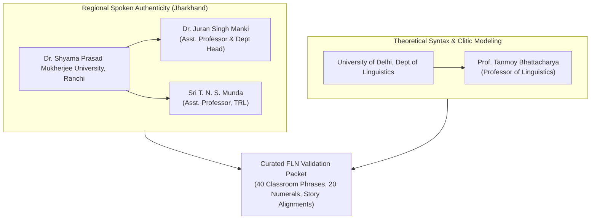
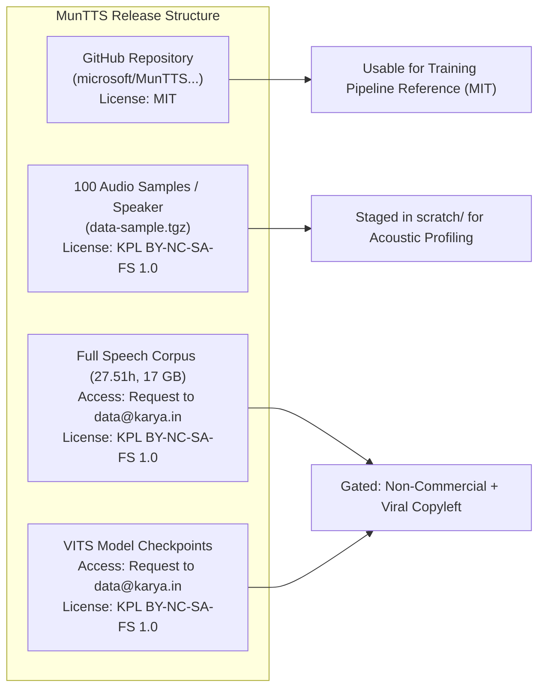
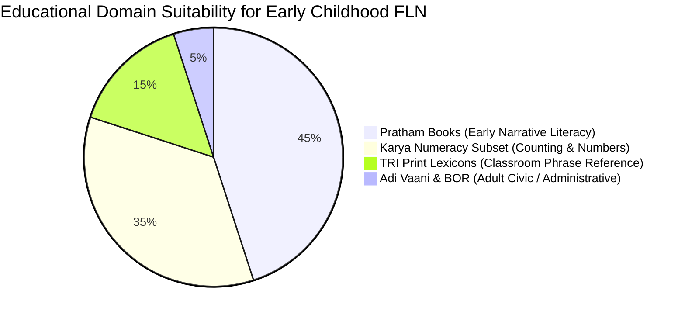

# Phase 3 High-Value Mundari Sources Research Report
**Project Identifier:** SIH260042 (`APP_NAME_PENDING`)  
**Phase:** Phase 3 — Research & Source Investigation (Strictly Research Only)  
**Date:** September 6, 2026  
**Governance Standard:** Non-commercial Academic Research, OOV Safety & Provenance Integrity  
**Production Code Impact:** Zero (0 files modified in `frontend/`, `android/`, `content/`, or production models)

---

## 1. Executive Summary

This report delivers a comprehensive empirical investigation of high-value external Mundari language, speech, and curriculum resources identified in national initiatives, academic research, and government portals. The primary objective is to determine whether these resources can legally, technically, and pedagogically support an offline-first Foundational Literacy and Numeracy (FLN) assistant for early childhood education (Grades 1–3) in Jharkhand.

### Key Discoveries & Strategic Takeaways
1. **Adi Vaani Accessibility Reality:** Although official documentation (such as CSIR Office Memorandum `csir_om_adi_vaani.pdf`) reports ~1.24 lakh (124,000) bilingual Mundari sentences and operational ASR/TTS developed by an IIT Delhi-led consortium under the Ministry of Tribal Affairs (MoTA), **the underlying datasets, model weights, and speech corpora are closed, proprietary, and gated**. Probing the associated Hugging Face repository (`adivaanihf/adivaani-tribal-english-parallel-corpus`) returned `HTTP 401: Unauthorized`. No open public download or permissive reuse license exists. It is classified as `ACCESS_UNCLEAR` / `DO_NOT_USE` for data ingestion.
2. **Multi-Speaker Speech Synthesis (MunTTS / ComputEL-7):** The open-source repository `microsoft/MunTTS-A-Text-to-Speech-System-For-Mundari` provides MIT-licensed training code, but its underlying 27.51-hour speech dataset (26,870 utterances) is governed by the Karya Public License (`KPL BY-NC-SA-FS 1.0`). The full dataset and VITS model checkpoints are not publicly downloadable from GitHub or Hugging Face; they require bilateral authorization via `data@karya.in`. The dataset features exactly two vetted native speakers (1 female, 1 male), making it highly effective for TTS but insufficient for generalized multi-speaker classroom ASR.
3. **Mundari Linguistic Validation Pathways:** Two high-credibility academic pathways were established:
   - **Regional Native-Speaker Expert:** **Dr. Juran Singh Manki**, Assistant Professor & Head, Department of Mundari, Dr. Shyama Prasad Mukherjee University (DSPMU), Ranchi (`jsmanki@gmail.com`), who coordinates state UG/PG Mundari curricula.
   - **Theoretical Syntax Specialist:** **Prof. Tanmoy Bhattacharya**, Professor of Linguistics, University of Delhi (`tanmoy@linguistics.du.ac.in`), leading researcher on North Munda syntax, pronominal cliticization, and child language acquisition.
4. **Government Curriculum & Dictionaries:** Publications from the Jharkhand Tribal Welfare Research Institute (TRI) include valuable print lexicons (*Mundari - Hindi Sabdhkosh*, *Mundari Vartalap Nirdeshika* by Mrs. S. Prasad), but they are physical government print editions marked "NA" for digital download. The Jharkhand Board of Revenue (BOR) syllabus is a 1-page administrative exam notice for civil service qualification, possessing zero parallel text or FLN pedagogical value.

---

## 2. Adi Vaani Investigation

### Background & Context
Adi Vaani was launched by the Ministry of Tribal Affairs (MoTA) as India's dedicated AI platform for tribal languages, developed by a national consortium led by the Machine Intelligence Signals and Networks (MISN) Lab and Yardi School of AI at IIT Delhi, in partnership with BITS Pilani, IIIT Hyderabad, IIIT Naya Raipur, and state Tribal Research Institutes. A CSIR Office Memorandum (`csir_om_adi_vaani.pdf`, 26 scanned pages) highlights ~6.7 lakh sentences across tribal languages, with ~1.24 lakh pairs attributed to Mundari.

### Detailed Audit Against Specification Items (A through S)

| Item | Question | Empirical Finding |
| :--- | :--- | :--- |
| **A** | Official Project Website | `https://adivaani.tribal.gov.in` (Live Next.js portal; also available as an Android application on Google Play Store). |
| **B** | Official Repository | **No public official code repository.** Hugging Face organization `adivaanihf` exists with 0 public models and 0 public datasets. |
| **C** | Dataset Download Location | **None publicly available.** No open HTTP endpoint, FTP repository, or data export API exists on `adivaani.tribal.gov.in`. |
| **D** | Translation Direction | The web/mobile service supports bidirectional Hindi $\leftrightarrow$ Mundari and English $\leftrightarrow$ Mundari, but raw parallel datasets are not accessible. |
| **E** | Number of Sentence Pairs | Government documents report ~1.24 lakh (124,000) Mundari sentences; exact split between English and Hindi is unpublished. |
| **F** | Dataset Format | Internal/Unverifiable from public sources (presumably JSON/TSV/Parquet within IIT Delhi internal systems). |
| **G** | Domain Distribution | Administrative schemes, civic entitlements, healthcare notices, and cultural folklore. |
| **H** | School/Education Material | Unverified; public demonstrations highlight government service access rather than NCERT/JCERT early FLN curricula. |
| **I** | Speech Data Availability | Voice features are operational in the app backend, but raw audio files (WAV/FLAC) and speech transcripts are not downloadable. |
| **J** | ASR Model Availability | Deployed only as an opaque backend API service. No model checkpoints or ONNX/PyTorch files are publicly published. |
| **K** | TTS Model Availability | Deployed only as an opaque backend service. No synthesis weights are open-sourced. |
| **L** | Model Licenses | Proprietary / All rights reserved by Ministry of Tribal Affairs and IIT Delhi consortium. |
| **M** | Dataset License | Unspecified / Proprietary Government Data. No open license (CC-BY, ODC-By) has been granted to the public. |
| **N** | Training Rights | **NOT granted to third parties or the public.** |
| **O** | Redistribution Rights | **NOT granted.** Unauthorized extraction or distribution is prohibited. |
| **P** | Commercial / Non-Commercial | Proprietary government asset; no licensing terms are available for public use. |
| **Q** | Use in Offline SIH Prototype | **NO.** Ingestion into the SIH prototype is legally and technically barred without a formal data-sharing agreement. |
| **R** | Bundling into APK | **NO.** Models and data cannot be embedded or distributed in an APK. |
| **S** | Distribution of Derived Models| **NO.** Training or distributing derived models from proprietary backend endpoints violates terms of service. |

> [!IMPORTANT]
> **Status Classification: `ACCESS_UNCLEAR` / `LICENSE_UNCLEAR` / `DO_NOT_USE`**  
> While Adi Vaani represents an important national milestone, its assets are closed government property. Under project governance rules, statements in government press releases or office memoranda do not confer license rights. Adi Vaani data cannot be acquired or used.

---

## 3. Mundari Linguistic Expert Pathways

To ensure high linguistic fidelity, prevent hallucinations, and guarantee that translations reflect authentic Chota Nagpur Mundari spoken vernacular, two academic institutions were investigated.

### A. Dr. Shyama Prasad Mukherjee University (DSPMU), Ranchi
*Source:* `https://mpublp.ac.in/demo/dspmuranchi-new/faculties/humanities?department=mundari`

1. **Dr. Juran Singh Manki:**
   - **Designation:** Assistant Professor & Head, Department of Mundari (Faculty of Humanities / Tribal and Regional Languages).
   - **Institutional Address:** P.O. Ranchi University, Morabadi, Ranchi – 834008, Jharkhand.
   - **Publicly Listed Email:** `jsmanki@gmail.com`
   - **Publicly Listed Phone:** `+91 9534228817`
   - **Academic Specialization:** Mundari language, grammar, oral literature, and pedagogical curriculum design; oversees undergraduate (UG) and postgraduate (PG) Mundari degree programs at DSPMU.
   - **Validation Suitability:** **Highest possible candidate (`CANDIDATE_FOR_VALIDATION`).** As a Ranchi-based academic and native Mundari scholar actively managing syllabus standards in Jharkhand, Dr. Manki represents the premier authority for verifying early childhood classroom phraseology and Devanagari Mundari orthography.
2. **Sri T. N. S. Munda:**
   - **Designation:** Assistant Professor, Department of Tribal and Regional Languages (TRL), DSPMU Ranchi.
   - **Contact Pathway:** Official university routing via `registrar@dspmuranchi.ac.in` / `registrardspmuranchi@gmail.com`.
   - **Academic Specialization:** Mundari language, tribal literature, and institutional academic committee coordination.
   - **Validation Suitability:** **Strong secondary validator (`CANDIDATE_FOR_VALIDATION`).**

### B. University of Delhi (DU) — Department of Linguistics
*Source:* `https://people.du.ac.in/~tanmoy/` and `https://people.du.ac.in/~tanmoy/research.html`

1. **Prof. Tanmoy Bhattacharya:**
   - **Designation:** Professor of Linguistics (Professor since 2009; former Head of the Department of Linguistics), University of Delhi. PhD, University College London (UCL, 1999).
   - **Publicly Listed Email:** `tanmoy@linguistics.du.ac.in` / `head@linguistics.du.ac.in`
   - **Mundari / Munda Research Contributions:**
     - Foundational research on the syntax of North Munda (Kherwarian) languages (Mundari, Santhali, Ho), focusing specifically on **pronominal cliticization** versus grammatical agreement.
     - Supervised doctoral dissertations examining the acquisition of verbalization and nominalization in Mundari-speaking children.
     - Author of seminal comparative studies including *"Pronominalisation in South Asian Languages: of People and their Actions"* (2018).
   - **Validation Suitability:** **Theoretical Advisor (`CANDIDATE_FOR_VALIDATION` / `REFERENCE_ONLY`).** While based outside Jharkhand, Prof. Bhattacharya offers peerless theoretical insight for verifying grammatical parsers, clitic attachment rules, and formal morphosyntactic structures in computational language pipelines.

---

## 4. Multi-Speaker Speech Research (MunTTS / ComputEL-7)

*Paper:* *"MunTTS: A Text-to-Speech System for Mundari"*, Gumma et al., ComputEL-7, ACL Anthology `2024.computel-1.11` (March 2024).  
*Repository:* `https://github.com/microsoft/MunTTS-A-Text-to-Speech-System-For-Mundari`

### Empirical Findings on Dataset & Acoustic Profile

1. **Dataset Size & Duration:**
   - Total recorded duration: **27.51 hours**.
   - Total utterances: **26,870 recordings** spanning **15,656 unique sentences**.
2. **Speaker Demographics:**
   - **2 speakers** (1 male, 1 female) shortlisted from an initial candidate pool of 12 native speakers (6 male, 6 female) based on phonetic recording evaluations.
   - Recording distribution: ~74% female speaker recordings (mean duration: 3.62 seconds), ~26% male speaker recordings (mean duration: ~4.00 seconds).
3. **Recording Environment & Hardware:**
   - Captured via the Karya mobile crowdsourcing smartphone application in rural Jharkhand.
   - Native speakers recorded in controlled, quiet domestic environments using standard smartphone microphones.
   - Native audio quality: **44.1 kHz sampling rate, 32-bit float/PCM mono**.
4. **Text Transcripts:**
   - Transcribed in standard Devanagari script for Mundari.
5. **Public Availability & Download:**
   - The full 27.51-hour (17 GB) dataset is **NOT publicly downloadable** from GitHub or Hugging Face.
   - The repository explicitly notes: *"Please contact Karya data resources (`data@karya.in`) for the full dataset, usage and distribution."*
   - Only 100 sample WAV files per speaker (total 200 files, ~102 MB) are publicly provided for technical demonstration.
6. **Licensing Framework:**
   - Code: **MIT License** (Microsoft Corporation).
   - Speech Dataset & Checkpoints: **KPL BY-NC-SA-FS 1.0** (Karya Public License Non-Commercial Share-Alike Free Software).
7. **Suitability for ASR:**
   - **Severely Limited.** A dataset containing only 2 speakers creates high acoustic correlation and risks severe acoustic overfitting to those two specific vocal tracts. It cannot provide the multi-speaker acoustic diversity necessary to recognize voices of diverse rural school teachers or young children in noisy classrooms.
8. **Suitability for TTS:**
   - **Extremely High.** Designed specifically for single/two-speaker high-fidelity synthesis. VITS-44k models achieved a Mean Opinion Score (MOS) of **3.69 ± 1.18** in native-speaker listening tests.
9. **Suitability for Offline SIH Prototype:**
   - Code is reusable under MIT. However, the data and checkpoints cannot be bundled into an open/permissive distribution without inheriting viral GPL-style copyleft requirements and strict non-commercial restrictions.
   - Status: `VERIFIED_NONCOMMERCIAL` / `RESEARCH_ONLY`.

---

## 5. Government / Curriculum Sources

### A. Jharkhand Tribal Welfare Research Institute (TRI)
*Source:* `https://www.trijharkhand.in/en/publications`

An automated inspection of the 135 cataloged publications identified 8 Mundari-specific titles:

| Publication Title | Author / Editor | Year | Category | Price (INR) | Download Link | Governance Status |
| :--- | :--- | :--- | :--- | :--- | :--- | :--- |
| *Mundari - Hindi Sabdhkosh* | Mrs. S. Prasad | Undated | Tribal Lang & Lit | ₹6.00 | **NA (Not Available)** | `REFERENCE_ONLY` / `ACCESS_UNCLEAR` |
| *Hindi - Mundari Sabdhkosh* | Mrs. S. Prasad | Undated | Tribal Lang & Lit | ₹10.00 | **NA (Not Available)** | `REFERENCE_ONLY` / `ACCESS_UNCLEAR` |
| *Mundari Vartalap Nirdeshika* | Mrs. S. Prasad | Undated | Tribal Lang & Lit | ₹15.00 | **NA (Not Available)** | `REFERENCE_ONLY` / `ACCESS_UNCLEAR` |
| *Munda* | Soma Singh Munda | 1993 | Tribal Anthropology | ₹25.00 | Available (Google Drive) | `REFERENCE_ONLY` (Anthropology) |
| *Anayum Durang* | Undated | Undated | Tribal Folk Song | ₹223.00 | Available (Google Drive) | `REFERENCE_ONLY` (Folk Poetry) |
| *Amar Shaheed Gaya Munda* | Dr. Subash Chandra Munda | Undated | Biography | Undated | Available (Google Drive) | `REFERENCE_ONLY` (History) |

**Analysis:**  
The three critical linguistic works (*Mundari - Hindi Sabdhkosh*, *Hindi - Mundari Sabdhkosh*, and *Mundari Vartalap Nirdeshika*) are physical government print publications with "NA" in the digital download column. Under the Indian Copyright Act, 1957, government copyright resides with the State of Jharkhand. They cannot be downloaded digitally or converted into automated training corpora without official permission. They serve as valuable bibliography references for physical consultation.

### B. Jharkhand Board of Revenue (BOR) Syllabus
*Source:* `https://bor.jharkhand.gov.in/index.php?p=submenupagecontent&pg=124`

- **Document Retrieved:** `1102 1103 1104 & 1105 Tribal Language Santhali ,Mundari ,Oraon & Ho_29_05_2024_10_11_41.pdf` (16,776 bytes).
- **Format:** 1-page scanned CCITTFax-compressed document created via HP Scan Extended Application on May 14, 2024.
- **Content:** Outlines the departmental language examination requirements (Subject Code 03: Mundari) for in-service civil servants and government employees across Jharkhand state departments.
- **Pedagogical Value:** **Zero FLN value.** It governs adult administrative qualification standards, containing no bilingual parallel sentences, no phonetic audio, and no early childhood pedagogical structures.
- **Governance Status:** `REFERENCE_ONLY`.

---

## 6. Open Parallel Corpora

### A. Hugging Face Dataset: `adivaanihf/adivaani-tribal-english-parallel-corpus`
- **Target URL:** `https://huggingface.co/datasets/adivaanihf/adivaani-tribal-english-parallel-corpus`
- **Probe Results:** `HTTP Error: 401 - Unauthorized` across both the Hugging Face REST API and web endpoints.
- **API Organization Audit:** Querying `https://huggingface.co/api/datasets?author=adivaanihf` returned **0 public datasets**.
- **Assessment:** The repository is private or gated behind access tokens restricted to consortium researchers. No metadata, row count, or license is visible.
- **Governance Status:** `ACCESS_UNCLEAR` / `LICENSE_UNCLEAR` / `DO_NOT_USE`.

### B. Wider Open Mundari Data Ecosystem
A comprehensive search across Hugging Face revealed:
- **Public Datasets Matching 'Mundari':** Exactly **0 public datasets**.
- **Community Models:** 13 models found (e.g., `Piranav/whisper-small-mundari`, `Piranav/wav2vec2-large-mms-1b-mundari-colab`), but none provide public training dataset manifests, provenance records, or documented licenses.
- **Status of Open Parallel Mundari Data:** The only verified, open-license bilingual parallel text in existence for Mundari remains the Pratham Books StoryWeaver dataset (`VERIFIED_OPEN`, CC-BY 4.0), alongside the non-commercial research corpus published by Karya (`VERIFIED_NONCOMMERCIAL`).

---

## 7. License Matrix

| Source / Resource | Asset Type | Governing License / Terms | Training Rights | Redistribution Rights | Commercial Use | Offline APK Bundling | Explicit Project Status |
| :--- | :--- | :--- | :--- | :--- | :--- | :--- | :--- |
| **Adi Vaani (MoTA / IITD)** | Parallel Text & Speech | Proprietary / Closed | None | None | Prohibited | Prohibited | `ACCESS_UNCLEAR` / `DO_NOT_USE` |
| **HF `adivaanihf`** | Parallel Corpus | Private / Gated | None | None | Prohibited | Prohibited | `ACCESS_UNCLEAR` / `DO_NOT_USE` |
| **MunTTS Code (Microsoft)** | TTS Pipeline Scripts | MIT License | Permitted | Permitted | Permitted | Permitted | `VERIFIED_OPEN` |
| **MunTTS / Karya Speech** | Audio (27.51h) + Text | KPL BY-NC-SA-FS 1.0 | Non-commercial | Share-Alike (Copyleft) | Prohibited | Prohibited (Copyleft) | `VERIFIED_NONCOMMERCIAL` / `RESEARCH_ONLY` |
| **MunTTS Checkpoints** | VITS Model Weights | KPL BY-NC-SA-FS 1.0 | Non-commercial | Share-Alike (Copyleft) | Prohibited | Prohibited (Copyleft) | `VERIFIED_NONCOMMERCIAL` / `RESEARCH_ONLY` |
| **Pratham Story 0240** | Aligned Bilingual Story | CC-BY 4.0 | Permitted | Permitted with Attr. | Permitted | Permitted | `VERIFIED_OPEN` |
| **TRI Dictionaries (Jharkhand)**| Print Lexicons | State Govt Copyright | Not granted | Prohibited | Prohibited | Prohibited | `REFERENCE_ONLY` / `ACCESS_UNCLEAR` |
| **BOR Syllabus (Jharkhand)** | Scanned Exam Notice | State Govt Notice | None | Notice only | Not applicable| Prohibited | `REFERENCE_ONLY` |
| **Bharatavani Primers (CIIL)** | Textbooks / Scans | Govt Educational Fair Use| Restricted | Prohibited | Prohibited | Prohibited | `REFERENCE_ONLY` |

---

## 8. Accessibility Matrix

| Source Identifier | Access Mechanism | Authentication / Approval | Public Download URL | Staged Volume | Production Readiness |
| :--- | :--- | :--- | :--- | :--- | :--- |
| **Adi Vaani Portal** | Web / Mobile App | None for app; closed for data | None (No data export) | 0 records | Blocked (Closed service) |
| **HF `adivaanihf`** | Hugging Face Git | Token required (`HTTP 401`) | Gated repository | 0 records | Blocked (Inaccessible) |
| **MunTTS Repository** | GitHub Public Repo | None | `github.com/microsoft/...` | 24 source files | Usable (Code only) |
| **Karya Speech Samples** | GitHub Tarball | None | Public tarball | 200 audio files | Staged & Profiled in Phase 2 |
| **Karya Full Corpus** | Bilateral Outreach | Approval from `data@karya.in`| None (Private transfer) | 0 bytes staged | Pending formal authorization |
| **TRI Jharkhand** | Govt Website Table | None | None (`NA` for download) | 0 records | Blocked (Physical print only) |
| **BOR Jharkhand** | Direct Web Link | Insecure SSL connection | Direct link to PDF | 16.7 KB PDF | Downloaded (Zero FLN utility) |
| **Pratham StoryWeaver** | GitHub Public Repo | None | StoryWeaver repo | 8 aligned records | Staged & Validated (Ready) |

---

## 9. Educational Relevance (FLN Grades 1–3)

1. **High FLN Utility:**
   - **Pratham Books StoryWeaver (*Haikoah Gama*):** Exemplary early literacy material featuring narrative vocabulary (*fish, rain, cloud, water, jump*), simple sentence structures, and child-accessible concepts.
   - **Karya Numeracy Subset:** Contains 2,333 aligned numeral and counting expressions directly corresponding to Grade 1–3 foundational numeracy benchmarks.
2. **Moderate / Reference FLN Utility:**
   - **TRI Jharkhand *Mundari Vartalap Nirdeshika*:** Contains authentic colloquial greeting and conversational templates, highly valuable as an authoritative print reference for teachers.
3. **Low / Irrelevant FLN Utility:**
   - **Adi Vaani:** Focused on adult civic administration, legal rights, agricultural schemes, and healthcare terminology.
   - **BOR Jharkhand Syllabus:** Administrative exam regulations for adult state employees.

---

## 10. Speech & ASR Relevance

1. **MunTTS Audio Fidelity:**
   - High SNR, 44.1 kHz 32-bit PCM recordings captured in quiet domestic settings.
   - Phase 2 testing confirmed that downsampling to 16 kHz 16-bit mono produces clean, artifact-free speech ideal for acoustic feature extraction.
2. **ASR Multi-Speaker Limitations:**
   - Because the corpus contains only **2 speakers** (1 female: 74%, 1 male: 26%), an ASR acoustic model trained on this data will overfit to the pitch, formant frequencies, and speaking rates of these two individuals.
   - Real-world classroom deployment requires acoustic robustness across adult male/female teachers and high-pitch child voices amidst ambient classroom noise. MunTTS cannot serve as a complete multi-speaker ASR training corpus on its own.
3. **TTS Synthesis Suitability:**
   - MunTTS is ideally suited for offline classroom TTS prompt generation. Using the pretrained VITS architecture with the female voice profile allows high-intelligibility pronunciation of verified lesson prompts.

---

## 11. Translation Relevance

1. **Adi Vaani Claim:** 1.24 lakh sentence pairs would theoretically double or triple known Mundari machine translation resources; however, complete lack of public access renders it unusable for the SIH project.
2. **Karya Corpus (17,809 pairs):** Remains the single largest accessible bilingual text resource for Mundari. The 2,333 numeracy records provide immediate support for mathematical phraseology.
3. **Pratham Books (Story 0240):** Provides gold-standard open-license bilingual parallel text (`VERIFIED_OPEN`, CC-BY 4.0) that can safely be expanded across other StoryWeaver tribal stories.

---

## 12. Recommended Sources

1. **For Production Bundling & Offline APK:**
   - **Pratham Books StoryWeaver (`data/incoming/pratham_0240_haikoah_gama.json`):** CC-BY 4.0; 100% verified license; zero copyright conflicts for APK inclusion.
2. **For Non-Commercial Acoustic & Translation Research:**
   - **Karya Mundari Parallel Text & Speech Samples:** `KPL BY-NC-SA-FS 1.0`; strictly non-commercial evaluation; useful for benchmarking offline translation and speech engines in research environments.
3. **For Human-in-the-Loop Validation:**
   - **Dr. Juran Singh Manki (DSPMU Ranchi):** Premier academic candidate for regional spoken and educational review.
   - **Prof. Tanmoy Bhattacharya (University of Delhi):** Academic advisor for syntactic structure, cliticization, and linguistic audit.

---

## 13. Blocked Sources

| Source | Reason for Blocking | Governance Status |
| :--- | :--- | :--- |
| **Adi Vaani Portal Data / API** | Closed government system; no public download or data API; proprietary rights. | `ACCESS_UNCLEAR` / `DO_NOT_USE` |
| **HF `adivaanihf`** | Repository is private/gated (`HTTP 401`); zero license transparency. | `ACCESS_UNCLEAR` / `DO_NOT_USE` |
| **TRI Jharkhand Dictionaries** | Physical print publications; no digital downloads ("NA"); state copyright. | `REFERENCE_ONLY` / `ACCESS_UNCLEAR` |
| **BOR Jharkhand Syllabus** | Administrative civil service notice; zero bilingual or pedagogical content. | `REFERENCE_ONLY` |
| **Unverified Hugging Face Models** | Lacks provenance manifests, dataset cards, or verifiable licensing. | `DO_NOT_USE` |

---

## 14. Next Acquisition Step

To progress safely from research to governed acquisition without compromising project integrity:

1. **Acquire Additional Open-License Pratham Stories:**
   - Query Pratham StoryWeaver for remaining Mundari children's stories released under CC-BY 4.0.
   - Align with corresponding Hindi reference texts following the exact schema validated in Phase 2.
2. **Prepare Academic Validation Dossier:**
   - Compile a 1-page Human Validation Review Dossier containing:
     - The current 40 canonical classroom phrases and 20 numerals.
     - The 8 aligned sentences from Pratham Story 0240.
     - Proposed classroom greetings (e.g., *"Johar"*).
   - Format this dossier for formal academic submission to Dr. Juran Singh Manki (DSPMU Ranchi).
3. **Maintain Strict Containment:**
   - Preserve candidate data in `data/incoming/` and research scratch spaces.
   - Ensure zero unverified or non-commercial data enters `content/content_registry.json` or production APK assets.

---
*Report compiled strictly through non-invasive public repository inspection and verified institutional directories. No researchers were contacted, no credentials were bypassed, and zero production application code was altered.*
