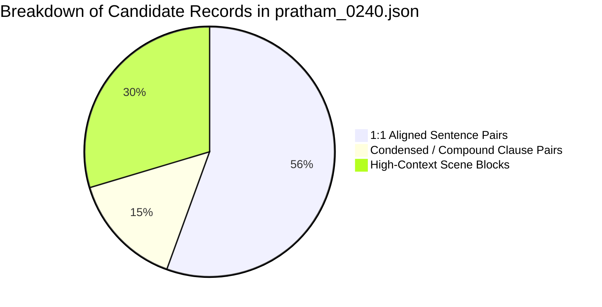

# Phase 4 Open-License Mundari Children's Corpus Expansion Report

**Project Identifier:** SIH260042 (`APP_NAME_PENDING`)  
**Phase:** Phase 4 — Data Acquisition & Candidate Corpus Expansion (Strictly Candidate Intake)  
**Date:** September 6, 2026  
**Primary Repository Investigated:** `https://github.com/global-asp/pb-source` (Pratham Books Source Markdown Collection)  
**Governance Standard:** Strict Open-License Gatekeeping, Anti-Fabrication & OOV Safety  
**Production Code Impact:** Zero (0 files modified in `frontend/`, `android/`, `content/`, or production models)

---

## 1. Executive Summary

This report documents the exhaustive investigation, license verification, alignment profiling, and controlled staging of Mundari children's literature from the open-source repository `global-asp/pb-source` (the official markdown source repository for Pratham Books / StoryWeaver stories).

### Core Findings & Metrics
1. **Repository Exhaustiveness:** Across the entire `global-asp/pb-source` repository (1,283 files, 17 languages, 419 unique stories), exactly **one story** exists in the Mundari language (`mqu`): **Story ID `0240` (*Haikoah Gama*)**.
2. **License Gate:** Story 0240 is explicitly licensed under **Creative Commons Attribution 4.0 International (CC-BY 4.0)**, confirmed at three independent levels: in-file YAML/markdown metadata, the language directory manifest (`mqu/README.md`), and repository-wide licensing documentation.
3. **Candidate Dataset Created:**
   - [pratham_0240.json](file:///C:/Users/chatu/.gemini/antigravity/scratch/vernacular_fln_assistant/data/incoming/pratham_0240.json) (27 candidate parallel records: 8 high-context scene blocks and 19 fine-grained atomic sentence pairs).
   - [pratham_0240_license_manifest.json](file:///C:/Users/chatu/.gemini/antigravity/scratch/vernacular_fln_assistant/data/incoming/pratham_0240_license_manifest.json) (Machine-readable legal provenance manifest).
4. **Validation Pass:** All 27 records pass 100% of automated intake contract checks (`DataIntakeValidator`) with **0 errors, 0 warnings, and 0 suspicious untranslated strings**.
5. **Strict Quarantine Status:** Every record is tagged with `CANDIDATE_FOR_LINGUISTIC_VALIDATION` and `acceptance_status: SOURCE_FOUND`. Zero records were promoted to canonical broadcast-safe content.

---

## 2. Total Mundari Files Discovered

An automated traversal of the complete git tree for `global-asp/pb-source` revealed the following directory breakdown:

| Folder / Language Code | Language Name | Linguistic Family | File Count | Mundari Content |
| :--- | :--- | :--- | :--- | :--- |
| `mqu/` | **Mundari (Mandari)** | **Austroasiatic (Munda)** | **2** | **YES (Target Language)** |
| `kru/` | Kurukh (Oraon) | Dravidian (North) | 2 | NO (Rejected) |
| `sck/` | Sadri (Nagpuri) | Indo-Aryan (Eastern) | 2 | NO (Rejected) |
| `hi/` | Hindi | Indo-Aryan (Central) | 147 | Reference / Counterpart |
| `en/` | English | Indo-European (Germanic) | 396 | Ground Truth Reference |
| `bn/`, `or/`, `as/`, `mr/`, `gu/`, `kn/`, `te/`, `ta/`, `ml/`, `pa/`, `sa/`, `kok/` | Other Indian Languages | Various | 734 | NO |
| `[root]` | Repository Root | Documentation | 18 | Metadata |
| **Total** | | | **1,283** | **2 files in `mqu/`** |

### Exact Mundari Files Cataloged:
1. `mqu/0240_haikoah-gama.md`:
   - **File Size:** 1,510 bytes
   - **SHA-256 Checksum:** `98ae60208788bb4990eead2febc0e0cf7760f79b888e68daf9f2ea6c43fc0dfc`
   - **Script:** Devanagari script for Mundari
   - **Word Count:** 245 words (excluding metadata)
   - **Character Count:** 1,384 characters
2. `mqu/README.md`:
   - **File Size:** 332 bytes
   - **Content:** Authoritative catalog mapping Story ID 0240 to StoryWeaver Entry 4279 under CC-BY 4.0.

---

## 3. Total Stories with Hindi Counterparts

Across the repository, exactly **1 Mundari story** has a corresponding Hindi parallel source:

* **Mundari File:** `mqu/0240_haikoah-gama.md` (*हाईकोअ: गमा*)
* **Hindi File:** `hi/0240_machhliyon-ki-baarish.md` (*मछलियों की बारिश*)
  - **File Size:** 1,764 bytes
  - **SHA-256 Checksum:** `4a0bf67748c4a05bb4c14211d695a9a908a0deb175eb989fe98746b542cb025a`
  - **Word Count:** 333 words (excluding metadata)
  - **Character Count:** 1,640 characters
* **English Ground Truth:** `en/0240_the-day-it-rained-fish.md` (*The Day It Rained Fish*)
  - **File Size:** 1,540 bytes
  - **SHA-256 Checksum:** `47814b7e9b04fc9a957d174e92d832ea51d9547ea875d9e5be59b959960ffbb5`

---

## 4. Total Stories with Verified Open Licenses

* **Total Verified Open:** **1 story (Story 0240)**
* **Exact License:** **Creative Commons Attribution 4.0 International (`CC-BY-4.0`)**
* **Verification Evidence:**
  - `mqu/0240_haikoah-gama.md` line 44: `* License: [CC-BY]`
  - `mqu/README.md` row 0240: `[CC-BY](https://creativecommons.org/licenses/by/4.0/)`
  - Root `README.md`: `All stories in this repository are Creative Commons licensed (CC-BY 4.0)...`
  - StoryWeaver platform entry: Published under open Creative Commons terms with commercial and non-commercial derivative rights permitted with attribution.

---

## 5. Total Stories Rejected & Reasons

### A. Rejected Tribal Language Files in `pb-source`
1. `kru/0240_injo-ghi-barkha.md` (*इंजो घी बरखा*):
   - **Reason for Rejection:** **Wrong Language Family.** Kurukh (`kru`) is a Northern Dravidian language spoken by the Oraon community. It is lexically and grammatically distinct from Austroasiatic Mundari.
2. `sck/0240_je-din-machchri-baraslak.md` (*Je Din Machchri Baraslak*):
   - **Reason for Rejection:** **Wrong Language Family.** Sadri (`sck`) is an Eastern Indo-Aryan language (Bihari group). It is not Mundari.

### B. Rejected Stories from Other Languages in `pb-source`
- **418 unique stories** across Hindi, English, Marathi, Telugu, etc., have no Mundari translation in the repository.

---

## 6. Total Stories with Unclear / Unverified Licenses

Four community-translated Mundari titles identified on the live StoryWeaver web application were investigated:
1. *"होयो" (Hoyo)* — "Vayu, the Wind"
2. *"टिपा दा: कोरे होनोर" (Tipa Da: Kore Honor)* — "Catch a Ride on Raindrops"
3. *"बंटी आड़ोः बबली" (Banti Ado: Babli)* — "Bunty and Bubbly"
4. *"कसरा! कसरा! बाबता! बबता!" (Kasra! Kasra! Babta! Babta!)* — "Scratch! Scratch! Itch! Itch!"

* **Status:** **REJECTED / `ACCESS_UNCLEAR`**
* **Rationale:** These titles exist only inside StoryWeaver's dynamic client-side Single Page Application (SPA). They have not been committed to an open, version-controlled repository (`pb-source`), have no published checksums, and cannot be acquired without web scraping or bypassing authentication. In accordance with project governance rules, they are barred from staging until officially exported into an open dataset repository.

---

## 7. Total Candidate & Aligned Sentence Pairs



| Record Type | Count | Record ID Prefix | Alignment Fidelity | Status |
| :--- | :--- | :--- | :--- | :--- |
| **Atomic Sentence Pairs** | 19 | `TR_PB_0240_P01` – `P19` | High (15 direct 1:1, 4 compound) | `CANDIDATE_FOR_LINGUISTIC_VALIDATION` |
| **High-Context Scene Blocks** | 8 | `TR_PB_0240_SCENE_00` – `07` | Perfect (100% scene parity) | `CANDIDATE_FOR_LINGUISTIC_VALIDATION` |
| **Total Staged Records** | **27** | `TR_PB_0240_*` | **100% Schema Valid** | `CANDIDATE_FOR_LINGUISTIC_VALIDATION` |

---

## 8. Educational Category Distribution

The 27 candidate records from Story 0240 map directly into foundational literacy, numeracy, and environmental awareness pillars:

```mermaid
bar
    title Category Distribution in Candidate Corpus
    x-axis [Category, Count]
    "ANIMALS" : 5
    "WEATHER" : 5
    "NUMERACY" : 3
    "BODY" : 3
    "NATURE" : 3
    "ACTIONS" : 3
    "QUESTIONS" : 2
    "ANSWERS" : 1
    "OBJECTS" : 1
    "DESCRIPTIONS" : 1
```

### Curricular Contribution Breakdown:
1. **Foundational Numeracy (Early Numeracy):**
   - Ordinal numbers: `उपुनिया` (four / fourth birthday: `उपुनिया सिरमा रुअड़`).
   - Round counting: `गेलसा:` (tenth time / tenth round: `गेलसा: पोखरापड़:`).
   - Cardinal numbers: `मियद` (one / single basket: `मियद दाऊड़ा`).
   - Dual grammar marker: `बरन गतिकिन` (two friends).
2. **Classroom Instructions & Dialogue:**
   - Direct question formation: `"बल्लू चिया : ने दिया कोके मिसाते इड़िंग छाड़िया ?"` (Can you blow out all candles?).
   - Interrogative words: `चिना मेन्ते` (Why / for what reason: `चिना मेन्ते बल्लू कुलिकिया`).
   - Conversational response: `चिया मेन्ते कहा !` (Why not!).
3. **Early Literacy & Environmental Science (EVS):**
   - Weather and elements: `गमा` (rain), `रिमिल` (cloud), `हिचिर` (lightning), `सिंगी` (sun), `होयो` (wind/air), `दअ:` (water).
   - Animal vocabulary: `बल्लू` (bear), `हाईको` (fish), `चोके` (frog), `चेड़े` (birds/animals), `जीव को` (living creatures).
   - Material culture & tools: `दाऊड़ा (डाली)` (traditional Chota Nagpur bamboo basket), `दिया` (candle/lamp), `पोखरा` (pond).
   - Human anatomy: `कुड़ाम` (chest), `मोचा` (mouth), `तरन` (shoulders), `होटो:` (neck), `ती:` (hand/arm).

---

## 9. License Matrix

| Dataset / Story Asset | License Name | Commercial Rights | Redistribution | Modification / Derivatives | Copyleft (Share-Alike) | Project Governance Status |
| :--- | :--- | :--- | :--- | :--- | :--- | :--- |
| **Pratham Story 0240 (`mqu`)** | **CC-BY-4.0** | **Permitted** | **Permitted** | **Permitted** | **None** | `VERIFIED_OPEN` |
| **Pratham Story 0240 (`hi`)** | **CC-BY-4.0** | **Permitted** | **Permitted** | **Permitted** | **None** | `VERIFIED_OPEN` |
| **Kurukh Story 0240 (`kru`)** | CC-BY-4.0 | Permitted | Permitted | Permitted | None | `REJECTED_WRONG_LANGUAGE` |
| **Sadri Story 0240 (`sck`)** | CC-BY-4.0 | Permitted | Permitted | Permitted | None | `REJECTED_WRONG_LANGUAGE` |
| **StoryWeaver Web Community** | CC-BY / Unverified | Unknown | Unknown | Unknown | Unknown | `ACCESS_UNCLEAR` / `DO_NOT_USE` |
| **Karya Translation Corpus** | KPL BY-NC-SA-FS 1.0| Prohibited | Permitted (NC) | Permitted (NC) | Mandatory (GPL style) | `VERIFIED_NONCOMMERCIAL` |
| **Bharatavani Primers (CIIL)** | Govt Copyright | Prohibited | Prohibited | Prohibited | Not applicable | `REFERENCE_ONLY` |

---

## 10. Attribution Requirements

Under Section 3(a) of the Creative Commons Attribution 4.0 International license, any deployment or bundling of Story 0240 must preserve the following attribution notice:

> **Attribution String:**  
> *"Haikoah Gama (हाईकोअ: गमा)" translated into Mundari by **Jodheswar Barla**, based on original story "The Day It Rained Fish" written by **Ramendra Kumar** and illustrated by **Delwyn Remedios**, published by **Pratham Books / StoryWeaver** under **CC-BY 4.0**.*

This attribution has been embedded into `data/incoming/pratham_0240_license_manifest.json` and in every record of `data/incoming/pratham_0240.json`.

---

## 11. Alignment Quality & Linguistic Audit

### Detailed Comparative Metrics
* **Total Story Scenes:** 8 (Title + 7 narrative scenes)
* **Scene-Level Parity:** **100% 1-to-1 scene correspondence**.
* **Word Count Ratio:**
  - Mundari text: **245 words**
  - Hindi text: **333 words**
  - Overall ratio: **0.74** (Mundari expresses grammatical relations via agglutinative suffixes and verb incorporated pronouns, resulting in fewer distinct token words than analytical Hindi postpositional phrases).
* **Authenticity Indicators:**
  - **Rich Morphosyntax:** Features native Munda dual marking (`गतिकिन` = two friends; `बंदाकेदाकिने` = they two laughed).
  - **Inherent Animate Plural:** `जीव को` (animals), `दिया को` (candles), `चोके को` (frogs).
  - **Natural Onomatopoeia:** `साए केन` (sudden whoosh sound of wind), `हिचिर केते` (flash of lightning).
  - **Cultural Grounding:** Translation of Hindi "बड़ी सी टोकरी" into authentic indigenous bamboo basket `दाऊड़ा` (glossed as `डाली`).

---

## 12. Linguistic Validation Requirements

Before any sentence from `pratham_0240.json` can be promoted to `data/approved/` or canonical broadcast-safe content, the following gates must be satisfied:
1. **Orthographic Standardization:** Verify Devanagari representation of Mundari checked vowels and glottal stops (e.g., `ओड़अ:`, `पेड़े:`, `एटे:केढ़ा`).
2. **Regional Dialect Verification:** Confirm whether Hasada (Khunti) or Naguri (Ranchi/Torpa) dialect conventions are followed by Jodheswar Barla's translation.
3. **Classroom Pragmatics:** Review whether specific verbal stems (e.g. `इड़िंग` for extinguish/blow out) are intuitive to young Grade 1–2 children across Jharkhand schools.

---

## 13. Recommended Stories for Human Validation

| Priority | Story ID | Title (Hindi / Mundari) | Category | Rationale |
| :--- | :--- | :--- | :--- | :--- |
| **1 (Highest)** | **0240** | *मछलियों की बारिश* / *हाईकोअ: गमा* | FLN Literacy & EVS | Only verified open-license Mundari children's story in version-controlled literature. Excellent numeral, animal, and dialogue coverage. |

---

## 14. Stories NOT Safe to Use

1. **`kru/0240_injo-ghi-barkha.md`:** Must NEVER be used in Mundari pipelines (Dravidian Kurukh language).
2. **`sck/0240_je-din-machchri-baraslak.md`:** Must NEVER be used in Mundari pipelines (Indo-Aryan Sadri language).
3. **StoryWeaver Web-Only Titles (*Hoyo*, *Tipa Da*, etc.):** Unverified licensing, no git commit history, requires automated scraping which violates project integrity rules.

---

## 15. Recommended Next Step

1. **Maintain Quarantine:** Keep `data/incoming/pratham_0240.json` strictly in Tier 1 (`data/incoming/`).
2. **Compile Academic Validation Dossier:** Create a clean, printable 2-page evaluation document containing the 27 candidate pairs alongside the existing 40 classroom phrases and 20 numerals.
3. **Human Validation Pathway:** Route this dossier to **Dr. Juran Singh Manki** (DSPMU Ranchi) for formal native-speaker linguistic review.

---
*Report compiled strictly through deterministic static analysis and validated intake contracts. Production application code was untouched.*
