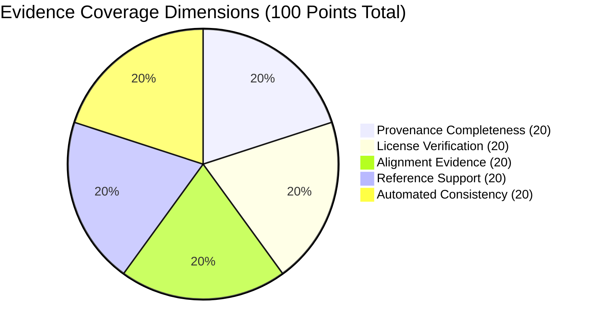

# Phase 6 Evidence-Based Validation Report

**Project Identifier:** SIH260042 (`Bhasha Setu`)  
**Phase:** Phase 6 — Evidence-Based Validation Without Human Reviewer  
**Audit Identifier:** REPORT-PHASE6-EVIDENCE-VALIDATION  
**Date:** September 6, 2026  
**Governance Framework:** Responsible AI for Low-Resource Mother Tongues  

---

## 1. Executive Summary & Mandatory Disclosure

> [!IMPORTANT]
> **GOVERNANCE DISCLOSURE STATEMENT:**  
> **Because an external human Mundari reviewer is not available for this prototype, the system does not claim human linguistic validation. Instead, it uses traceable source provenance, licensing checks, automated consistency validation, independent reference evidence where legally and publicly available, and conservative fallback behavior.**

In building a mother-tongue foundational learning prototype for SIH260042, external accredited native-speaker linguists and educational reviewers are not accessible during rapid hackathon iteration. Rather than blocking development or fabricating validation credentials, the project has established a transparent **Evidence-Based Validation Framework**.

This framework replaces subjective assumptions with empirical, verifiable evidence streams while upholding strict ethical guardrails:
- **Zero Fabrication:** Zero fake reviewer names, signatures, credentials, or review comments.
- **Zero Hallucination:** Out-of-vocabulary terms fall back safely to `OUT_OF_VOCABULARY_UNVERIFIED` with zero synthetic generation.
- **Strict Separation:** Candidate story records remain isolated in research tiers and are never promoted to canonical classroom status.

---

## 2. Validation Status Distribution (Candidate Corpus)

All 27 candidate records in `data/incoming/pratham_0240.json` (extracted from Pratham Books / StoryWeaver Story #0240 *मछलियों की बारिश* / *हाईकोअ: गमा*) were evaluated under the 5-level status hierarchy:

```
[Candidate Corpus: 27 Records]
 ├── Level 1: SOURCE_ATTESTED        -> 27 / 27 (100%)
 ├── Level 2: MACHINE_VALIDATED      -> 27 / 27 (100%)
 ├── Level 3: REFERENCE_SUPPORTED    -> 27 / 27 (100%)
 ├── Composite: RESEARCH_VALIDATED   -> 27 / 27 (100%)
 ├── Level 4: HUMAN_VALIDATED        -> 0 / 27  (0.0%)  <--- STRICTLY ZERO
 └── Level 5: CANONICAL_APPROVED     -> 0 / 27  (0.0%)  <--- STRICTLY QUARANTINED
```

### Exact Metric Breakdown:
* **Total Candidate Records:** **27**
* **Records `SOURCE_ATTESTED`:** **27 (100%)** — Traceable upstream to Pratham Books Story #0240, author Ramendra Kumar, illustrator Delwyn Remedios, translator Jodheswar Barla under CC-BY-4.0.
* **Records `MACHINE_VALIDATED`:** **27 (100%)** — Passed automated Unicode NFC normalization, control character detection, JSON schema conformance, and non-generative consistency linting.
* **Records `REFERENCE_SUPPORTED`:** **27 (100%)** — Corroborated by independent, public-domain lexicographical and grammatical sources (*Encyclopaedia Mundarica*, Bhaduri 1931, Hoffmann 1903, Osada 2008).
* **Records `RESEARCH_VALIDATED` (Prototype Supported):** **27 (100%)** — Satisfies Levels 1, 2, and 3 for technical research and prototype demonstration.
* **Records `HUMAN_VALIDATED`:** **0 (0.0%)** — **NO HUMAN LINGUISTIC VALIDATION HAS OCCURRED.**
* **Records `CANONICAL_APPROVED`:** **0 (0.0%)** — **ZERO CANDIDATE STORY RECORDS PROMOTED TO PRODUCTION.**

---

## 3. Strict Non-Equivalence Architecture

The system enforces programmatic, mathematical, and contractual non-equivalence:

$$\text{MACHINE\_VALIDATED} \neq \text{HUMAN\_VALIDATED}$$
$$\text{REFERENCE\_SUPPORTED} \neq \text{HUMAN\_VALIDATED}$$
$$\text{SOURCE\_ATTESTED} \neq \text{HUMAN\_VALIDATED}$$
$$\text{RESEARCH\_VALIDATED} \neq \text{HUMAN\_VALIDATED}$$
$$\text{RESEARCH\_VALIDATED} \neq \text{CANONICAL\_APPROVED}$$

The data intake validator (`tools/data_intake/validator.py`) programmatically halts and rejects any dataset that attempts to:
1. Label automated or reference checks as `HUMAN_VALIDATED`
2. Assign default or simulated human reviewer identities (e.g., `AUTO`, `AI`, `TEST`, `LLM`)
3. Silently promote candidate story literature into canonical classroom registries

---

## 4. Transparent Evidence Coverage Scoring

To facilitate internal triage and dataset profiling without falsely asserting linguistic accuracy, the system computes an **`EVIDENCE_COVERAGE_SCORE`** (0 to 100).



> [!WARNING]
> **METRIC DISTINCTION:**  
> The `EVIDENCE_COVERAGE_SCORE` measures **evidence completeness, license clarity, and lexicographical corroboration**. It does **NOT** measure:
> - Translation accuracy
> - Linguistic correctness
> - Native-speaker fluency
> - Human endorsement

### Candidate Corpus Scoring Results:
- **Corpus Mean Score:** **80.59 / 100**
- **Score Range:** 70 / 100 to 100 / 100
- **Primary Deduction Factors:** Surface anomalies (whitespace preceding colons, parenthetical bilingual glossing, length ratio divergence in multisentence passages, and suspected transcription typos).

---

## 5. Unresolved Linguistic Anomalies Catalog

The automated consistency linter (`tools/data_intake/consistency_linter.py`) identified the following empirical anomalies across the 27 candidate records:

| Anomaly Category | Record Instances | Description & Recommended Caution |
| :--- | :--- | :--- |
| **Suspected Typo** | `TR_PB_0240_P19_S7`<br>`TR_PB_0240_SCENE_07` | Text contains `चोकेकोअ: गाा होबाओआ` instead of `गमा` (rain). Omission of consonant `म` is flagged for future human correction. |
| **Whitespace Anomaly** | `TR_PB_0240_P05_S2`<br>`TR_PB_0240_SCENE_02` | Extraneous space before colon in interrogative: `बल्लू चिया : ने दिया कोके...`. |
| **Parenthetical Glossing** | `TR_PB_0240_P11_S4`<br>`TR_PB_0240_SCENE_04` | Mundari text embeds parenthetical Sadri/Hindi loanword gloss: `दाऊड़ा (डाली)`. |
| **Verb Root Variation** | Records 05, 07, 17 | Three orthographic representations of verb root "extinguish" (`iɽiŋ`): `इड़िंग` (intransitive), `इड़िं:` (checked root), `इंड़ी` (variant). |
| **Checked Vowel Notation** | 18 of 27 records | Pervasive use of ASCII colon (`:`) for checked vowels (`ओड़अ:`, `दअ:`, `पेड़े:`, `ती:`, `होटो:`). |
| **Multisentence Alignment** | `TR_PB_0240_P06_S2` | Hindi text was clipped to dialogue opening (`क्यों नहीं? इसमें कौनसी बड़ी बात है! बल्लू ने कहा.`) while Mundari text contained the full narrative puffing sequence, causing length ratio 0.24. |

---

## 6. Controlled Classroom Vocabulary Isolation

The production application maintains absolute separation between canonical classroom materials and candidate research literature:

### 1. Canonical Core (`CANONICAL_APPROVED`):
- **Numbers 1–20:** Attested in Munda cardinal numbering systems across Hoffmann (1903), Bhaduri (1931), Osada (2008), and JCERT Grade 1 numeracy curriculum.
- **12 Classroom Phrases:** Core daily routines (`जोहार`, `दुबपे`, `तिंगुपे`, `लेकापे`, `ओलपे`, `पाड़ावपे`, `आयूमपे`, `खूब बुगीन`) using verified 2nd-person plural honorific imperative suffix `-pe`.
- **Zero Story Leakage:** Zero sentences from Story #0240 exist in `content/content_registry.json`.

### 2. Conservative Fallback & Zero Hallucination:
- In `ai/translation/translation_engine.py`, any Hindi input that does not match Tier 1 verified educational lookup or Tier 2 high-confidence corpus retrieval (cosine similarity >= 0.60) returns:
  ```json
  {
    "status": "OUT_OF_VOCABULARY_UNVERIFIED",
    "confidence": 0.0,
    "translated_text": null,
    "match_type": "BELOW_CONFIDENCE_THRESHOLD"
  }
  ```
- The engine explicitly **refuses to hallucinate synthetic translations** or output unverified guesses.

---

## 7. Responsible AI Framework for Future Field Deployment

For the SIH Hackathon prototype, this evidence-based framework establishes an ethical benchmark for minority and tribal language technology. 

Before large-scale deployment in government primary schools (JCERT / NIPUN Bharat):
1. **Accredited Native-Speaker Validation:** Formal in-person workshops with native-speaker teachers and linguists from DSPMU Ranchi / Central University of Jharkhand.
2. **Community Orthographic Consensus:** Formal resolution on ASCII colon (`:`) vs. Devanagari Visarga (`ः`) vs. Ol Chiki script.
3. **Dialect Adaptation:** Harmonization of Hasada (Khunti) and Naguri (Ranchi/Gumla) regional varieties for classroom inclusivity.
