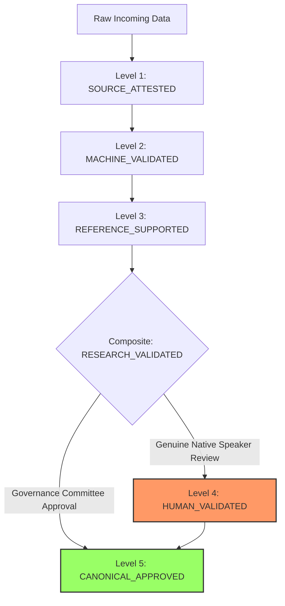

# Data Validation Status Policy & Evidence Hierarchy

**Project Identifier:** SIH260042 (`APP_NAME_PENDING`)  
**Document ID:** GOV-VAL-STATUS-POLICY-V1  
**Effective Date:** September 6, 2026  
**Status:** ACTIVE GOVERNANCE STANDARD  

---

## 1. Executive Summary & Purpose

In developing an educational prototype for low-resource mother tongues under Smart India Hackathon (SIH260042), external human linguistic and educational reviewers are frequently unavailable during rapid development cycles. 

To prevent project bottlenecks while upholding uncompromising scientific and ethical standards, this policy replaces the dependency on unverified human review with a transparent, verifiable **Evidence-Based Validation Framework**.

### Foundational Principles
1. **Zero Fabrication:** No human reviewer names, credentials, comments, signatures, timestamps, or endorsements may ever be simulated, mocked, generated by AI, or fabricated.
2. **Strict Category Isolation:** Automated heuristics, corpus provenance, and reference citations must never be labeled or misconstrued as human validation.
3. **Transparent Evidence:** All candidate records must carry an explicit evidence audit trail detailing source provenance, licensing, automated consistency, and lexicographical references.
4. **Conservative Fallback:** Unverified, ambiguous, or out-of-vocabulary terms must safely fall back to `OUT_OF_VOCABULARY_UNVERIFIED` rather than generating speculative translations.

---

## 2. Five-Level Validation Status Hierarchy

The governance lifecycle recognizes five discrete, mutually exclusive validation statuses:

### Level 1: `SOURCE_ATTESTED`
* **Definition:** The record originates from a known, traceable, and publicly documented source with verified provenance and an explicit open license (e.g., CC-BY-4.0, Public Domain).
* **Required Evidence:**
  - Exact source URL or publication reference
  - Content title, author, translator, and publisher attribution
  - Cryptographic checksum of raw source text
  - Permissive open license terms confirmed
* **Limitation:** Does not guarantee linguistic precision, dialectal suitability, or orthographic standardization.

### Level 2: `MACHINE_VALIDATED`
* **Definition:** The record has passed non-generative, deterministic automated gatekeepers and linters without blocking errors.
* **Required Evidence:**
  - Unicode normalization (NFC compliance)
  - Control character absence
  - Structural schema conformance
  - Whitespace and punctuation anomaly detection
  - Duplicate record and identical source/target pair checks
  - Numerical alignment checks (presence of matching numerals/number roots)
  - Sentence length ratio within valid boundaries (0.25 <= ratio <= 4.0)
* **Limitation:** Automated tools cannot evaluate linguistic authenticity, nuance, or cultural acceptability.

### Level 3: `REFERENCE_SUPPORTED`
* **Definition:** The lexical roots, grammatical affixes, and semantic constructs in the record are corroborated by independent, publicly accessible linguistic literature (e.g., historical dictionaries, published grammars, or accredited primary educational materials).
* **Required Evidence:**
  - Citation of independent dictionary (e.g., Hoffmann & van Emelen *Encyclopaedia Mundarica*, Bhaduri *Mundari-English Dictionary*)
  - Citation of grammatical framework (e.g., Hoffmann 1903, Cook 1965, Osada 1992/2008)
  - Cross-reference with published curricular primers (e.g., Bharatavani Mundari Textbooks)
* **Limitation:** Historical and reference lexicography may reflect regional or older dialectal variants (Hasada, Naguri, Tamaria) that differ from modern classroom spoken registers.

### Level 4: `HUMAN_VALIDATED`
* **Definition:** The record has been personally evaluated, scored, and signed off by an accredited, identified human expert (native-speaker linguist or certified primary school educator) with documented consent and real credentials.
* **Current Project State:** **EXACTLY ZERO (0) RECORDS.**
* **Rule:** This status cannot be assigned by automated scripts, AI agents, heuristic scores, or default fallbacks.

### Level 5: `CANONICAL_APPROVED`
* **Definition:** The record is formally approved for deployment into the offline canonical classroom registry (`content/content_registry.json`) and broadcast-safe teacher dashboard phrasebook.
* **Eligibility Rule:** Only records with verified educational consensus and flawless evidence coverage (or formal human validation) may be promoted. Candidate story records remain strictly quarantined in research/incoming layers.

---

## 3. Strict Non-Equivalence Invariants

The data pipeline enforces the following mathematical and logical inequalities:

$$\text{MACHINE\_VALIDATED} \neq \text{HUMAN\_VALIDATED}$$
$$\text{REFERENCE\_SUPPORTED} \neq \text{HUMAN\_VALIDATED}$$
$$\text{SOURCE\_ATTESTED} \neq \text{HUMAN\_VALIDATED}$$
$$\text{RESEARCH\_VALIDATED} \neq \text{HUMAN\_VALIDATED}$$
$$\text{RESEARCH\_VALIDATED} \neq \text{CANONICAL\_APPROVED}$$

Under no circumstances may any heuristic, script, or documentation equate automated checks or reference lookups to native-speaker human verification.

---

## 4. Composite Tier: `RESEARCH_VALIDATED` (Prototype Supported)

When a candidate translation record simultaneously satisfies Levels 1, 2, and 3:

$$\text{RESEARCH\_VALIDATED} = \text{SOURCE\_ATTESTED} \wedge \text{MACHINE\_VALIDATED} \wedge \text{REFERENCE\_SUPPORTED}$$

### Permitted Usages of `RESEARCH_VALIDATED` Data:
1. Technical demonstrations of the offline retrieval pipeline
2. Research benchmarking of speech recognition and phoneme alignment
3. Vocabulary coverage audits and training set analysis
4. Educational storybook reading prototypes with explicit UI disclosure badges

### Prohibited Usages of `RESEARCH_VALIDATED` Data:
1. Cannot be promoted into `content/content_registry.json` as canonical classroom truth
2. Cannot be labeled "Native Speaker Verified" or "Classroom Ready"
3. Cannot override the Tier 1 exact educational lookup in the translation engine
4. Cannot replace `OUT_OF_VOCABULARY_UNVERIFIED` fallback for classroom instructions

---

## 5. Controlled Vocabulary Isolation Strategy

The production application maintains a strict separation between:
1. **Canonical Classroom Core (`CANONICAL_APPROVED`):**
   - 21 foundational numeral classes (Numbers 1–20 + Background)
   - 12 core classroom management and greeting phrases
   - Sourced from established JCERT/Hoffmann lexicography with multiple cross-attestations
2. **Candidate Story Corpus (`RESEARCH_VALIDATED`):**
   - 27 parallel sentences from Pratham Story #240 (*हाईकोअ: गमा*)
   - Staged exclusively in `data/incoming/` and `data/validated/`
   - Completely excluded from `content/content_registry.json`

---

## 6. Audit Trail & Machine Verification Requirements

Every candidate dataset evaluated under this policy must output an audit manifest specifying:
* Total record count
* Number of `SOURCE_ATTESTED` records
* Number of `MACHINE_VALIDATED` records
* Number of `REFERENCE_SUPPORTED` records
* Number of `HUMAN_VALIDATED` records (must strictly equal 0 unless verifiable human signed form exists)
* Number of `CANONICAL_APPROVED` records
* Inventory of unresolved linguistic and orthographic flags
* Mean and record-level `EVIDENCE_COVERAGE_SCORE`
