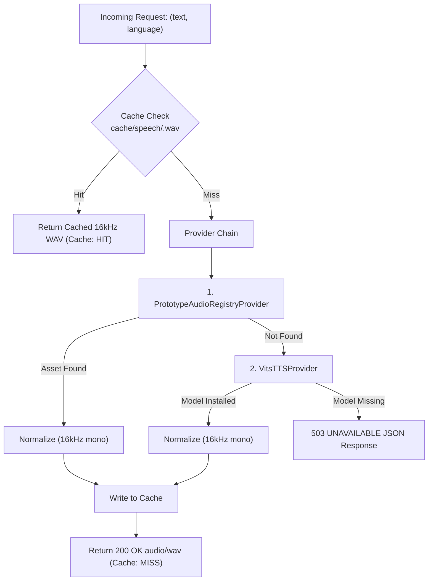

# Bhasha Setu Offline Pronunciation & TTS Service Specification

**Project**: Bhasha Setu (AI-Powered Vernacular FLN Assistant — Hindi <-> Mundari)  
**Endpoint**: `POST /api/pronunciation`  
**Architecture**: 100% Offline / Local Execution  
**Status**: Production / Local Bridge API  

---

## 1. Overview & Architectural Principles

The **Bhasha Setu Pronunciation Service** generates and streams offline spoken audio for Hindi and Mundari educational phrases. It adheres to strict offline and data governance mandates:

1. **100% Offline Local Architecture**: Designed for rural primary classrooms without continuous internet connectivity. Does NOT require any cloud API or external API key.
2. **Zero Runtime Downloads**: Models are never silently downloaded during API requests. If a required model is missing, the service returns a transparent, structured `503 UNAVAILABLE` response.
3. **Deterministic Audio Caching**: Caches normalized 16 kHz PCM WAV files at `cache/speech/<hash>.wav` using SHA-256 hashes of `language + text + engine_id` to eliminate repetitive computation.
4. **Path-Traversal Resistance**: Cache file names are strictly 64-character hexadecimal strings generated via cryptographic hashing. Arbitrary user text cannot escape the cache directory.
5. **Anti-Fabrication & Labeling Integrity**:
   - Synthetic TTS and prototype assets are **NEVER** labeled or claimed as "native-speaker verified" or "certified classroom ground truth".
   - Headers explicitly communicate asset provenance: `PROTOTYPE_ONLY_PENDING_HUMAN_VALIDATION` vs. `SYNTHETIC_GENERATED_TTS`.

---

## 2. API Contract

### Canonical Endpoint

```http
POST /api/pronunciation
Content-Type: application/json
```

### Request Body Schema

```json
{
  "text": "मोड़ेया",
  "language": "mundari"
}
```

#### Parameter Validation Rules

| Field | Type | Required | Constraints | Description |
| :--- | :--- | :--- | :--- | :--- |
| `text` | `string` | **Yes** | 1 to 250 characters. Non-empty string. | Text in Devanagari script to pronounce. |
| `language` | `string` | **Yes** | Case-insensitive: `"hindi"`, `"hi"`, `"mundari"`, `"unr"` | Target language of the utterance. |

---

### Response Specifications

#### 1. Successful Synthesis (`200 OK`)

Returns raw uncompressed 16-bit PCM WAV audio.

- **`Content-Type`**: `audio/wav`
- **`Content-Length`**: Byte size of audio stream
- **`X-Pronunciation-Language`**: `hindi` or `mundari`
- **`X-Pronunciation-Engine`**: Engine identifier (e.g. `prototype_audio_registry` or `facebook/mms-tts-unr`)
- **`X-Pronunciation-Source`**: `prototype_asset`, `neural_tts`, or `cached`
- **`X-Pronunciation-Cache`**: `HIT` or `MISS`
- **`X-Pronunciation-Validation-Status`**: `PROTOTYPE_ONLY_PENDING_HUMAN_VALIDATION` or `SYNTHETIC_GENERATED_TTS`

#### 2. Validation Failure (`400 Bad Request`)

```json
{
  "status": "INVALID_INPUT",
  "message": "Text exceeds maximum allowable length of 250 characters.",
  "language": null,
  "details": null
}
```

#### 3. Missing Local Model / Asset (`503 Service Unavailable`)

```json
{
  "status": "UNAVAILABLE",
  "message": "Pronunciation audio is currently unavailable for hindi text: 'पाँच'.",
  "language": "hindi",
  "details": "Hindi neural TTS model is not installed. To install 'facebook/mms-tts-hin' (VITS 36.3M, ~145 MB), run 'python scripts/download_tts_models.py --lang hindi' or set BHASHA_SETU_HINDI_TTS_MODEL_PATH."
}
```

---

## 3. Provider Architecture

The service coordinates multiple providers in order of provenance:



### 1. `PrototypeAudioRegistryProvider`
- **Scope**: Grade 1 FLN Numerals 1–20 and 16 Core Classroom Commands cataloged in `content/audio/audio_manifest.json`.
- **Classification**: Prototype educational audio.
- **Availability**: Actively available in the repository.

### 2. `VitsTTSProvider`
- **Scope**: General synthetic speech synthesis for arbitrary Hindi and Mundari sentences.
- **Engine**: Meta MMS-TTS VITS Architecture (36.3M parameters, ~145 MB each).
  - Hindi: `facebook/mms-tts-hin`
  - Mundari: `facebook/mms-tts-unr`
- **Local Model Paths**:
  - `models/tts/mms-tts-hin/` or env var `BHASHA_SETU_HINDI_TTS_MODEL_PATH`
  - `models/tts/mms-tts-unr/` or env var `BHASHA_SETU_MUNDARI_TTS_MODEL_PATH`
- **Availability Rule**: Only reported as available when model weights exist physically on disk.

---

## 4. Controlled Model Installation (Pre-Deployment)

To install the Meta MMS-TTS models for full offline synthesis:

```powershell
# Inspect target models without downloading
python scripts/download_tts_models.py --dry-run

# Download Hindi VITS model (~145 MB)
python scripts/download_tts_models.py --lang hindi

# Download Mundari VITS model (~145 MB)
python scripts/download_tts_models.py --lang mundari

# Download both models for full classroom autonomy
python scripts/download_tts_models.py --lang all
```

---

## 5. Provenance & External Licensing

| Model Identifier | Original Developer | Architecture | License | Intended Role |
| :--- | :--- | :--- | :--- | :--- |
| `facebook/mms-tts-hin` | Meta AI | VITS (36.3M params) | **CC-BY-NC 4.0** | Offline Hindi speech generation |
| `facebook/mms-tts-unr` | Meta AI | VITS (36.3M params) | **CC-BY-NC 4.0** | Offline Mundari speech generation |

> [!IMPORTANT]
> External model identities and licensing are preserved verbatim in Bhasha Setu documentation. External weights are never rebranded as proprietary Bhasha Setu models.
