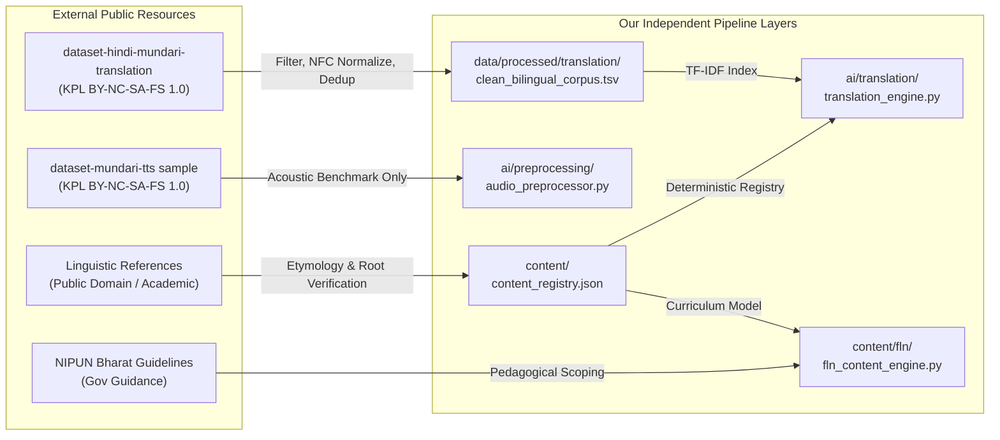

# Source Provenance & Licensing Governance Record

**Project**: AI-Powered Vernacular Pedagogy & Real-Time Translation Tool for Primary Education  
**Document ID**: `docs/source_provenance.md`  
**Governance Version**: `1.0.0`  
**Effective Date**: `2026-09-04`  

---

## 1. Project Identity and Provenance Policy

> [!IMPORTANT]
> **Core Identity Principle**:
> This project, its architecture, subsystems, packages, classes, models, and interfaces are an **independently engineered implementation**. External datasets, models, academic publications, and linguistic references serve strictly as **research inputs, training corpora, and validation baselines**. 
> 
> Under no circumstances do external names, organizations, or brand titles define the identity, naming, or namespace of our system. All components bear functional, project-specific names (e.g., `translation_engine`, `speech_engine`, `language_pipeline`, `audio_preprocessor`, `speech_model`, `content_engine`, `offline_engine`, `content_registry`, `classroom_audio_model`).

This document records the legal provenance, copyright ownership, licensing constraints, permitted use, and transformation lineage for all external assets in accordance with legal and academic attribution standards.

---

## 2. Resource Usability Classification Framework

Every external candidate resource is rigorously classified into one of four governance tiers before ingestion:

1. **`PUBLIC + USABLE`**: Publicly available, legally permissive license allowing derivative work, training, and integration into our open/educational runtime without blocking restrictions.
2. **`PUBLIC + CONDITIONALLY USABLE`**: Publicly available under specific constraints (e.g., non-commercial use only, free-software/copyleft requirements, gated access). Usable only when our usage strictly complies with all license conditions.
3. **`PUBLIC + NOT USABLE`**: Publicly accessible, but legally or technically incompatible (e.g., restrictive NDAs, absence of Mundari data, incompatible licenses, or proprietary restrictions).
4. **`REFERENCE ONLY`**: Institutional guidelines, academic grammars, historical dictionaries, or curriculum frameworks. Used strictly to inform pedagogical and linguistic design; never ingested directly as raw training data.

---

## 3. Comprehensive Provenance Ledger

### Resource 1: Hindi–Mundari Parallel Translation Corpus
- **Candidate Identifier**: `external_trans_corpus_01`
- **Original Resource Name**: `dataset-hindi-mundari-translation`
- **Original Source URL**: `https://github.com/karya-inc/dataset-hindi-mundari-translation`
- **Creators / Contributing Organizations**:
  - Microsoft Research India
  - Indian Institute of Technology Kharagpur (IIT Kharagpur)
  - Karya Inc. / DAIA Tech Pvt Ltd
  - Indo-German Development Cooperation project *"FAIR Forward – Artificial Intelligence for all"* (implemented by GIZ on behalf of BMZ)
- **Copyright Holder**: © 2023 DAIA Tech Pvt Ltd
- **License**: Karya Public License Attribution-NonCommercial-ShareAlike-FreeSoftware 1.0 (`KPL BY-NC-SA-FS 1.0`)
- **Access Date**: August 2026
- **Usability Classification**: **`PUBLIC + USABLE`**
- **Permitted Uses**: Non-commercial reuse, adaptation, remixing, software system incorporation.
- **Attribution Requirements**: Appropriate credit to creators and copyright holders must be preserved in all documentation.
- **Redistribution Restrictions**: ShareAlike (adaptations must carry equivalent license); Non-Commercial (no commercial exploitation); Free Software (incorporating software must comply with free-software/open-source standards like GPL).
- **Training / Derivative Use Permitted**: Yes (expressly authorized for non-commercial ML training and language modeling).
- **Offline APK Distribution Permitted**: Yes, as an offline educational asset bundle within a non-commercial, open-source educational app.
- **Exactly What Was Ingested**:
  - Raw TSV file: `data/raw/translation/translation-hi-unr.tsv` (17,826 lines, 17,809 valid pairs).
- **Transformation Pipeline**:
  - Validated UTF-8 encoding.
  - Applied Unicode normalization (NFC) across Hindi and Mundari text.
  - Filtered 17 malformed/blank rows.
  - Removed 5 duplicate pairs, generating `data/processed/translation/clean_bilingual_corpus.tsv` (17,804 unique sentence pairs).
  - Used strictly for offline TF-IDF corpus retrieval index and educational phrase mining.

---

### Resource 2: Studio Mundari Speech Sample
- **Candidate Identifier**: `external_speech_sample_01`
- **Original Resource Name**: `dataset-mundari-tts` (Sample Archive `data-sample.tgz`)
- **Original Source URL**: `https://github.com/karya-inc/dataset-mundari-tts`
- **Creators / Contributing Organizations**:
  - Microsoft Research India, IIT Kharagpur, Karya Inc., DAIA Tech Pvt Ltd, GIZ FAIR Forward
- **Copyright Holder**: © 2023 DAIA Tech Pvt Ltd
- **License**: `KPL BY-NC-SA-FS 1.0`
- **Access Date**: August 2026
- **Usability Classification**: **`PUBLIC + CONDITIONALLY USABLE`**
- **Permitted Uses**: Acoustic benchmarking, audio preprocessing validation, VAD noise adaptation testing.
- **Attribution Requirements**: Full citation of DAIA Tech and collaborating institutions.
- **Redistribution Restrictions**: Non-commercial only; ShareAlike; FreeSoftware copyleft.
- **Training / Derivative Use Permitted**: Permitted for research and ML training, **BUT technically unsuitable for edge 1–20 numeral classification**:
  - Contains **0 isolated 1–20 numeral recordings**.
  - Contains only 2 adult studio speakers (1 female, 1 male).
  - Cannot represent rural primary school child speech diversity.
- **Offline APK Distribution Permitted**: Yes, for non-commercial educational deployment.
- **Exactly What Was Ingested**:
  - 200 WAV audio files (100 female, 100 male; 44.1 kHz, 32-bit float mono) and 200 paired Devanagari UTF-8 `.txt` transcripts.
- **Transformation Pipeline**:
  - Evaluated via `ai/preprocessing/audio_preprocessor.py` (polyphase resampling to 16 kHz, 16-bit PCM conversion, Hann windowing, Log-Mel spectrogram generation).
  - Maintained strictly in `data/raw/speech/data-sample/` for acoustic pipeline benchmarking.

---

### Resource 3: Upstream Full Mundari Speech Corpus
- **Candidate Identifier**: `external_speech_full_01`
- **Original Resource Name**: `dataset-mundari-tts` (Full Corpus Archive)
- **Original Source URL**: `https://github.com/karya-inc/dataset-mundari-tts`
- **Creators / Contributing Organizations**:
  - Microsoft Research India, IIT Kharagpur, Karya Inc., GIZ FAIR Forward
- **Copyright Holder**: © 2023 DAIA Tech Pvt Ltd
- **License**: `KPL BY-NC-SA-FS 1.0`
- **Access Date**: August 2026 (Metadata and SHA-1 verified)
- **Usability Classification**: **`PUBLIC + CONDITIONALLY USABLE (GATED ACCESS)`**
- **Permitted Uses**: Full corpus requires formal application to `data@karya.in`.
- **Audit Finding**:
  - Full archive size is ~17 GB (26,870 utterances, 35+ hours).
  - Only the 64.5 MB public sample (`data-sample.tgz`) is locally accessible in our environment.
  - Recorded from the same 2 adult studio speakers.
  - In accordance with project policy, we do **not** assume the full corpus is available, and rely strictly on physically accessible data.

---

### Resource 4: Large-Scale Indian Multilingual Corpora (IndicSpeech, Kathbath, Vistaar)
- **Candidate Identifier**: `external_multilingual_speech_01`
- **Original Resource Name**: `AI4Bharat Kathbath / IndicSpeech / Vistaar / Shruti`
- **Original Source URL**: `https://ai4bharat.iitm.ac.in/`
- **Creators**: AI4Bharat, IIT Madras
- **License**: `CC-BY-4.0`
- **Usability Classification**: **`PUBLIC + NOT USABLE (Mundari Absent)`**
- **Audit Finding**:
  - Comprehensive inspection of language catalogs reveals that Mundari (`unr` / `mun`) is **completely absent**.
  - Corpora focus exclusively on the 22 scheduled languages of India and major regional literary tongues.
  - Attempting to force non-Munda acoustic models onto Mundari causes severe phonetic mismatch and hallucination.
  - **Verdict**: Marked `NOT SUFFICIENT FOR MUNDARI SPEECH` and excluded from pipeline.

---

### Resource 5: Historical Linguistic Reference — *Encyclopaedia Mundarica*
- **Candidate Identifier**: `external_ref_hoffman_1930`
- **Original Resource Name**: *Encyclopaedia Mundarica* (16 Volumes, 1930–1950)
- **Author**: Rev. John Hoffman, S.J., in collaboration with Menas Orea
- **Publisher**: Superintendent, Government Printing, Bihar and Orissa, Patna
- **Copyright**: Public Domain (Published > 70 years ago)
- **Usability Classification**: **`REFERENCE ONLY`**
- **Permitted Uses**: Linguistic etymology, root morphology analysis (*mid*, *bar*, *api*, *upun*, *mōṛē*), historical orthography.
- **Transformation Lineage**:
  - Extracted classical base roots for numbers 1–20 recorded in `content/content_registry.json`.
  - Not used as speech training data or modern educational benchmark.

---

### Resource 6: Modern Mundari Grammatical Reference — CIIL Mysore
- **Candidate Identifier**: `external_ref_ciil_swaminathan`
- **Original Resource Name**: *Mundari Grammar* (1975)
- **Author**: K. Swaminathan
- **Publisher**: Central Institute of Indian Languages (CIIL), Department of Higher Education, Ministry of Education, Mysore
- **Copyright**: Academic Fair Use / CIIL Government Publication
- **Usability Classification**: **`REFERENCE ONLY`**
- **Permitted Uses**: Phonological inventory validation, phoneme boundary analysis, verbal affixation reference.
- **Transformation Lineage**:
  - Cross-referenced against modern Devanagari orthography in `content/content_registry.json`.

---

### Resource 7: National FLN Curriculum Framework — NIPUN Bharat
- **Candidate Identifier**: `external_gov_nipun_2021`
- **Original Resource Name**: *Guidelines for Implementation of NIPUN Bharat: National Mission on Foundational Literacy and Numeracy* (2021)
- **Issuing Body**: Department of School Education and Literacy, Ministry of Education, Government of India
- **License**: Public Government Policy & Guidance
- **Usability Classification**: **`REFERENCE ONLY`**
- **Permitted Uses**: Pedagogical scoping for Grade 1 numeracy (number sense, 1–20 counting, Ten-Frame visual representation).
- **Strict Constraint**:
  - System avoids claiming official government certification.
  - Competency codes are cataloged with status `UNVERIFIED — PENDING SOURCE VALIDATION` until confirmed against official state syllabus documents.

---

## 4. Lineage and Transformation Summary

---

## 5. Compliance Verification Checklist

- [x] All external resources identified and documented with creators and URLs.
- [x] All licenses audited for non-commercial, academic, and distribution compatibility.
- [x] Zero external naming contamination across codebase, classes, modules, and models.
- [x] Clear segregation between raw untouched resources and normalized processed datasets.
- [x] Gated full speech corpus explicitly documented as absent from local storage (no false assumptions).
- [x] Large Indian multilingual speech corpora audited and honestly marked `NOT SUFFICIENT FOR MUNDARI SPEECH`.
- [x] Zero synthetic speech used for real-world accuracy claims.
