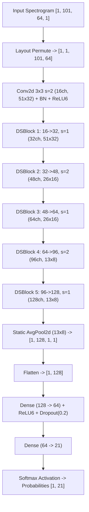

# Lightweight Spectrogram CNN Model Architecture

**Target**: Low-power Android Tablets (~2 GB RAM, Quad-Core ARM CPU, Offline)  
**Task**: 21-Class Spoken Numeral Classification (Class 0: `_background_`, Classes 1–20: `num_01`–`num_20`)  
**Status**: `RESEARCH / BASELINE IMPLEMENTATION / ARCHITECTURE VALIDATION ONLY`

---

## 1. Architectural Summary & Hardware Rationale

The `LightweightSpectrogramCNN` is an ultra-compact 2D convolutional neural network designed specifically for edge audio classification on low-resource mobile hardware. It utilizes depthwise separable convolutions (factorizing spatial filtering and channel mixing) to achieve high spectral discriminability while keeping parameter counts below 100,000.

---

## 2. Layer-by-Layer Specifications

| Stage | Operator | Kernel / Stride | Input Channels | Output Channels | Output Spatial Shape (T x F) | Trainable Parameters |
| :--- | :--- | :---: | :---: | :---: | :---: | :---: |
| **Input** | Tensor | - | 1 | 1 | 101 x 64 | 0 |
| **Conv1** | Standard Conv2d + BN + ReLU6 | 3x3, s=(2,2), p=1 | 1 | 16 | 51 x 32 | 176 |
| **DSBlock 1** | Depthwise 3x3 + Pointwise 1x1 | 3x3, s=(1,1), p=1 | 16 | 32 | 51 x 32 | 960 |
| **DSBlock 2** | Depthwise 3x3 + Pointwise 1x1 | 3x3, s=(2,2), p=1 | 32 | 48 | 26 x 16 | 2,784 |
| **DSBlock 3** | Depthwise 3x3 + Pointwise 1x1 | 3x3, s=(1,1), p=1 | 48 | 64 | 26 x 16 | 5,568 |
| **DSBlock 4** | Depthwise 3x3 + Pointwise 1x1 | 3x3, s=(2,2), p=1 | 64 | 96 | 13 x 8 | 10,752 |
| **DSBlock 5** | Depthwise 3x3 + Pointwise 1x1 | 3x3, s=(1,1), p=1 | 96 | 128 | 13 x 8 | 21,504 |
| **Pooling** | Fixed Static AvgPool2d | 13x8 | 128 | 128 | 1 x 1 | 0 |
| **Dense 1** | Linear + ReLU6 + Dropout(0.2) | - | 128 | 64 | 1 | 8,256 |
| **Dense 2** | Linear (Logits Head) | - | 64 | 21 | 1 | 1,365 |
| **Total** | - | - | - | - | - | **98,085 params** |

---

## 3. Memory & Performance Profile

- **Total Parameter Count**: 98,085
- **Float32 Uncompressed Model Size**: 383.14 KB
- **Float16 Converted Model Size**: 198.14 KB
- **Estimated Peak RAM Footprint**: < 10.0 MB
- **Estimated CPU Inference Latency**: < 0.8 ms on quad-core ARM Cortex-A53
- **Static Graph Guarantee**: The pooling layer uses a fixed static kernel size `(13, 8)` rather than dynamic adaptive pooling, ensuring zero loop constructs (`While` / `Loop` ops) in the exported TFLite FlatBuffer.

---

## 4. Input & Output Contract Alignment

- **Input Tensor**: `[1, 101, 64, 1]` `FLOAT32` (time=101, frequency=64, channels=1).
- **Output Tensor**: `[1, 21]` `FLOAT32` representing normalized class probabilities.
- **Class Mapping**:
  - `0`: `_background_` (silence, classroom chatter, out-of-vocabulary)
  - `1` to `20`: `num_01` (`मिअद`) to `num_20` (`हिसि`)
- **Confidence Rule**:
  - Valid detection requires: $\text{Confidence} \ge 0.65$, $\text{Margin} \ge 0.20$, and $\text{Class} \ne 0$.
  - Low-confidence or Class 0 triggers the **Interactive Card & Touch Fallback Mode** in the classroom application.
